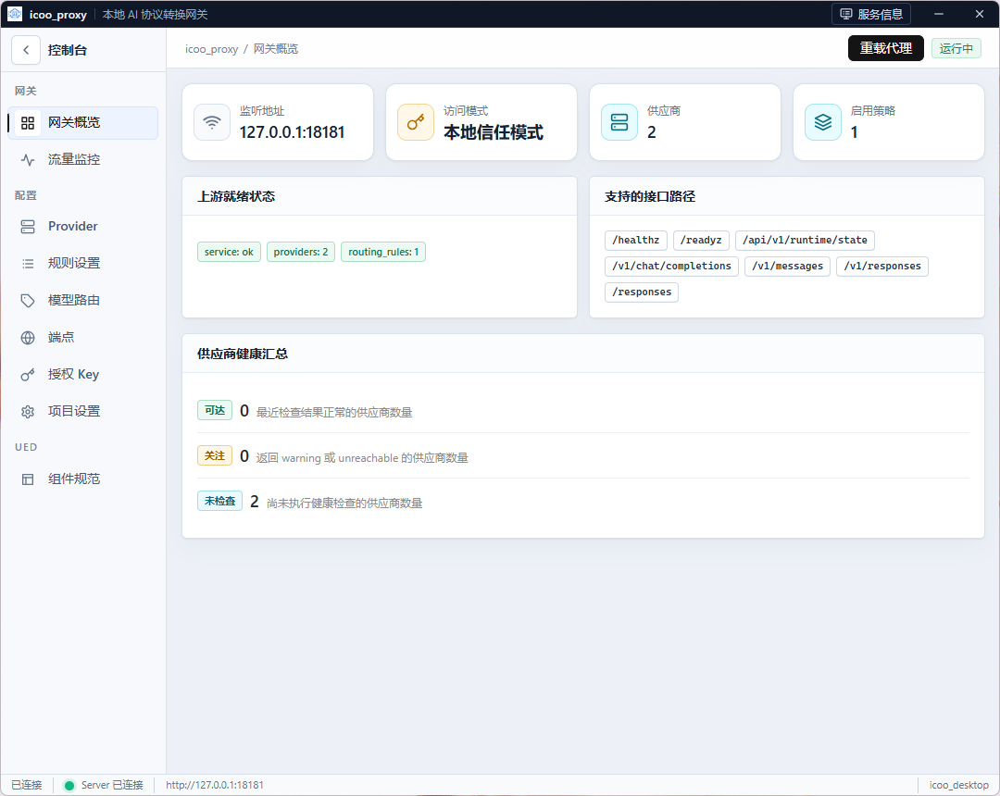
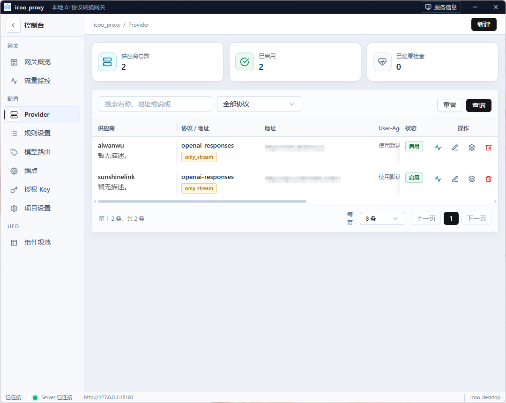
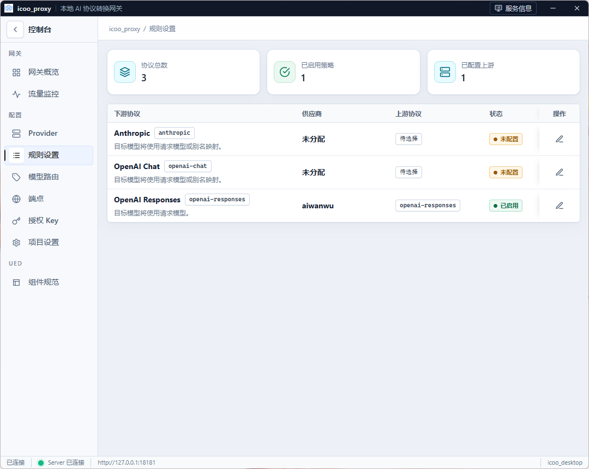
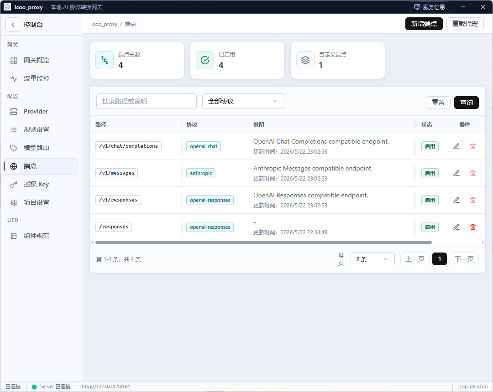
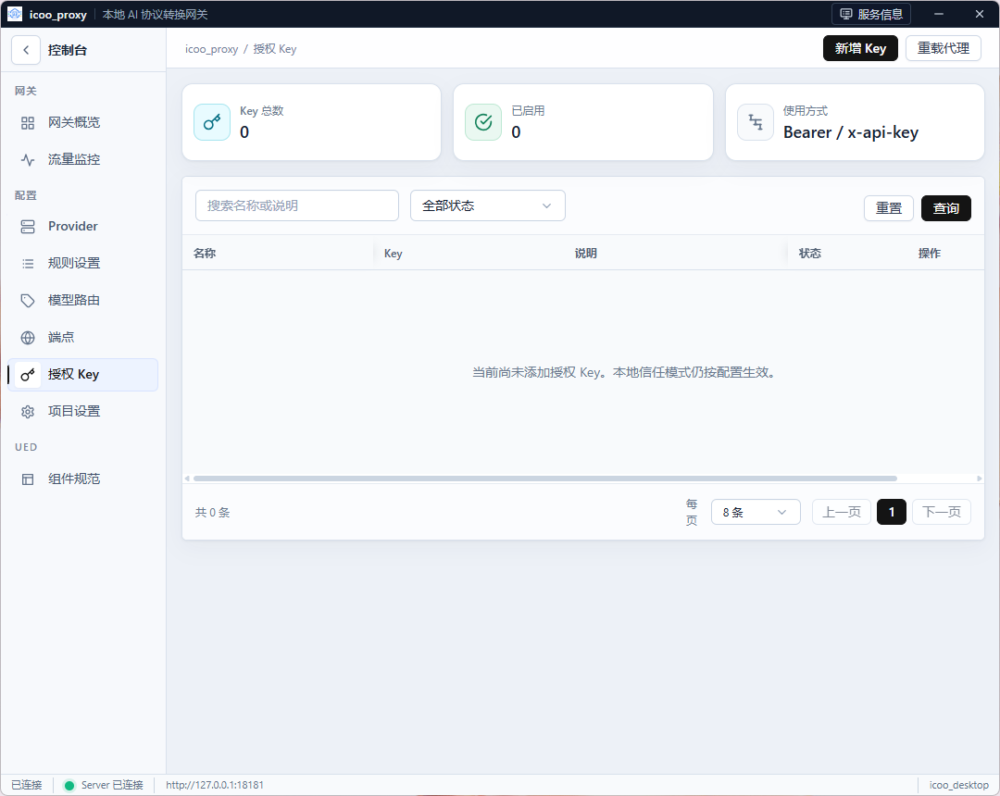
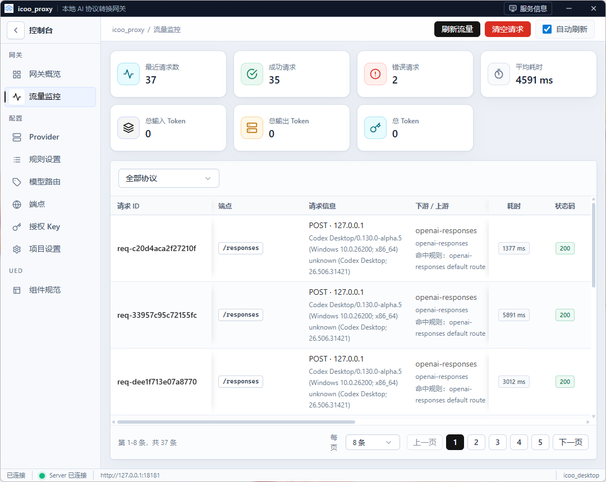
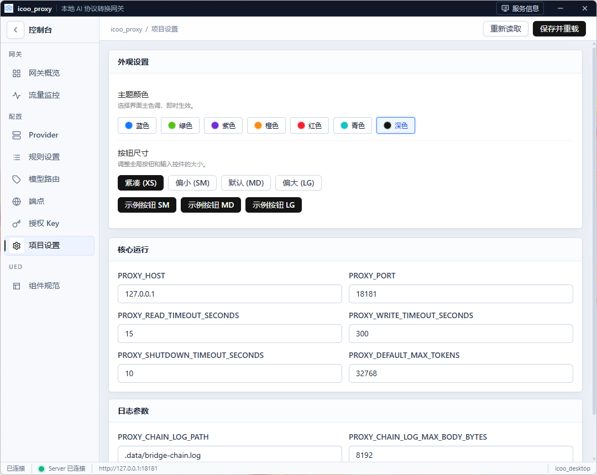

# icoo_proxy

本地优先的 LLM API 转换网关和桌面管理端。

`icoo_proxy` 对下游暴露 OpenAI Chat Completions、OpenAI Responses、Anthropic Messages 兼容接口，并按供应商、模型、路由策略把请求转发到不同上游或**进程插件**。后端位于 `bridge`（模块 `github.com/issueye/icoo_proxy/bridge`），桌面端位于 `desktop`（`github.com/issueye/icoo_proxy/desktop`），公共库位于 `common`（`github.com/issueye/icoo_proxy/common`），可选插件位于 `plugins/*`。仓库使用 Go workspace（`go.work`，Go 1.23）组织多模块。

- English documentation: [README.md](README.md)
- 文档索引：[docs/README.md](docs/README.md)
- Workspace 说明：[docs/workspace.md](docs/workspace.md)
- 管理接口 OpenAPI：[docs/openapi.yaml](docs/openapi.yaml)
- 插件 IPC 契约 / SDK：[docs/plugin-ipc-contract.md](docs/plugin-ipc-contract.md) · [docs/plugin-ipc-sdk.md](docs/plugin-ipc-sdk.md)
- 版本：根目录 [`VERSION`](VERSION)（当前 **2.0.1**）· 许可证：[Apache-2.0](LICENSE)

## 功能特性

- 本地 HTTP 网关，支持：
  - `POST /v1/chat/completions`
  - `POST /v1/responses`
  - `POST /v1/messages`
  - `GET /v1/models`
- 管理供应商、模型、端点、路由规则、API Key、流量记录与进程插件。
- OpenAI Chat、OpenAI Responses、Anthropic Messages 之间的协议转换。
- SSE 流式响应；同协议流式可低延迟透传。
- 进程插件：Windows Named Pipe / Unix UDS + 长度前缀 JSON-RPC（`common/pluginipc`）。
- Wails v2 + Vue 3 桌面管理端（**不**链接 `bridge` / `common`）。
- 双 SQLite：主库 + 流量库（WAL）。
- 供应商健康检查、运行时数据库诊断、插件扩展页（经 Bridge 反代嵌入）。

## 仓库结构

```text
.
├── go.work                 # Go workspace 根
├── VERSION / CHANGELOG.md  # 单一版本源
├── common/                 # 公共模块（ai_llm_proxy、pluginipc 等）
├── bridge/                 # 网关宿主（Gin + GORM/SQLite）
├── desktop/                # 桌面端（Wails + Vue）
├── plugins/                # 进程插件（mock、grokbuild 等）
├── docs/                   # 文档索引、OpenAPI、IPC 契约、设计/计划
├── icoo_proxy/             # 打包输出目录（非源码模块）
├── scripts/                # OpenAPI 与打包冒烟测试
└── build-all.ps1           # 一键构建脚本
```

## 环境要求

- Windows PowerShell（主打包路径）
- Go 1.23+
- Node.js 和 npm
- Wails CLI（构建桌面端）

```powershell
go install github.com/wailsapp/wails/v2/cmd/wails@latest
```

## 快速开始

```powershell
# 一键输出到 .\icoo_proxy\
.\build-all.ps1

# 或分模块构建
cd bridge;  .\build.ps1
cd desktop; .\build.ps1 -BridgePath ..\bridge\build\bridge.exe
```

默认监听：`127.0.0.1:18181`。

```powershell
Invoke-RestMethod http://127.0.0.1:18181/healthz
Invoke-RestMethod http://127.0.0.1:18181/readyz
Invoke-RestMethod http://127.0.0.1:18181/api/v1/runtime/state
```

默认本机回环可免 API Key 访问管理接口。不要在未配置鉴权的情况下把服务暴露到非本机网络。

## 构建网关

```powershell
cd bridge
.\build.ps1
# .\build.ps1 -SkipTests
```

输出：`bridge\build\bridge.exe`

```powershell
cd bridge
.\build\bridge.exe
```

配置样例：[`bridge/configs/config.example.toml`](bridge/configs/config.example.toml)。

## 构建桌面端

```powershell
cd desktop
.\build.ps1 -BridgePath ..\bridge\build\bridge.exe
```

输出：

```text
desktop\build\bin\icoo_desktop.exe
desktop\build\bin\bridge.exe
```

仅开发前端：

```powershell
cd desktop\frontend
npm install
npm run dev
```

桌面端不 import `bridge` / `common`，以子进程方式启动 `bridge.exe`，并通过 HTTP 管理 API 通信。详见 [desktop/README.md](desktop/README.md)。

## 桌面管理端

桌面管理端是本地运行 `icoo_proxy` 的推荐入口：启动/重启网关、查看连接状态，管理供应商/路由/端点/授权 Key/流量/设置，发现进程插件，并嵌入插件扩展页。



### Provider 管理



新建供应商时填写名称、协议（`openai-responses` / `openai-chat` / `anthropic` 或插件供应商）、基础地址、API Key、可用模型。健康检查会用第一个已启用模型发一次最小真实上游请求（消耗少量额度）。

### 路由规则



将下游协议映射到上游供应商与协议。解析顺序：

1. 直连路由，例如 `provider-name/model-name`。
2. 按优先级排序的启用路由规则。

### 入口端点



默认启用：

- `/v1/chat/completions`：OpenAI Chat 客户端
- `/v1/messages`：Anthropic Messages 客户端
- `/v1/responses` 与 `/responses`：OpenAI Responses 客户端

### 授权 Key



客户端可用 `Bearer` 或 `x-api-key`。绑定本机且策略允许时，本地信任模式仍可免 Key 做管理操作。

### 流量监控



查看请求列表、成功/错误、耗时、Token、协议、命中规则、状态码（含客户端取消 `499`）等。

### 项目设置



调整控制台外观与网关运行参数（地址、端口、超时、默认 max tokens、链路日志等）。保存后可重载由桌面端托管的 bridge 进程。

## 进程插件

插件是**独立进程**，不是共享库：

- 分发包：`plugins/<id>/info.toml` + 可执行文件（与 `bridge.exe` 同级或 cwd 扫描）。
- 传输：Windows Named Pipe / Unix UDS；帧：长度前缀 JSON-RPC 2.0（可跟 raw body 帧）。
- 宿主负责生命周期（拉起、心跳、自动重启、Job Object / PGID）。
- 插件只依赖 `common`，**禁止** import `bridge/internal/...`。

| 插件 | 说明 |
|------|------|
| [`plugins/mock`](plugins/mock/README.md) | 最小 SDK 样例，用于集成测试 |
| [`plugins/grokbuild`](plugins/grokbuild/README.md) | 可选 Grok Build / SuperGrok 适配（默认关闭；见免责声明） |

```toml
[plugins.entries.grokbuild]
enabled = true
executable = "plugins/grokbuild/plugin-grokbuild.exe"
data_dir = ".data/plugins/grokbuild"
```

完整契约：[docs/plugin-ipc-contract.md](docs/plugin-ipc-contract.md)。

## 协议转换矩阵

实现权威说明：[`common/ai_llm_proxy`](common/ai_llm_proxy/README.md)。未支持的请求方向返回稳定的 `not implemented` 错误。

### 请求（下游 → 上游）

| 下游 \\ 上游 | Anthropic | OpenAI Chat | OpenAI Responses |
| --- | --- | --- | --- |
| Anthropic | 透传 | **未实现** | 已支持 |
| OpenAI Chat | 已支持 | 透传 | 已支持 |
| OpenAI Responses | 已支持 | **未实现** | 透传 |

### 非流式响应与 SSE（上游 → 下游）

3×3 全部支持。同协议 SSE 为低延迟透传；部分跨协议工具调用流会为语义完整性做缓冲。

## 主要接口

代理：

```text
POST /v1/messages
POST /v1/chat/completions
POST /v1/responses
GET  /v1/models
```

管理（完整列表见 OpenAPI，含插件）：

```text
GET  /api/v1/runtime/state
GET  /api/v1/providers
POST /api/v1/providers
POST /api/v1/providers/:id/check
GET  /api/v1/ingress-endpoints
GET  /api/v1/routing-rules
GET  /api/v1/api-keys
GET  /api/v1/traffic
GET  /api/v1/plugins
GET  /api/v1/plugins/ui-pages
```

## 存储

| 路径 | 用途 |
|------|------|
| `.data/icoo_llm_bridge.db` | 供应商、路由、密钥、UI 偏好等 |
| `.data/icoo_llm_bridge_traffic.db` | 流量记录（独立库，WAL） |
| `.data/bridge-chain.log` | 可选链路日志 |
| `.data/plugins/<id>/` | 插件运行时状态 / 凭据 |

## 验证

```powershell
# 仓库根目录（go.work）
go test ./common/...
go test ./bridge/...
go test ./desktop
go test ./plugins/mock/...
go test ./plugins/grokbuild/...

cd desktop\frontend
npm ci
npm run lint
npm run format:check
npm test
npm run build

# 契约与打包
.\scripts\Test-OpenAPI.ps1
.\build-all.ps1
.\scripts\Test-Package.ps1 -PackageDir .\icoo_proxy
```

## 运维注意

- 部分上游高并发会返回 `429`，生产建议限流、重试或退避。
- 跨协议流式（尤其工具调用）可能缓冲；同协议透传为低延迟路径。
- 推荐本机回环部署；勿将未鉴权管理面暴露到公网。
- 插件仅接收允许列表请求头；宿主 token 不会出现在插件列表类管理接口中。

## 打包方式

`.\build-all.ps1` 推荐交付结构：

```text
icoo_proxy\
├── icoo_desktop.exe
├── bridge.exe
└── plugins\
    ├── mock\
    │   ├── info.toml
    │   └── mockplugin.exe
    └── grokbuild\
        ├── info.toml
        └── plugin-grokbuild.exe
```

启动 `icoo_desktop.exe` 即可；`bridge.exe` 与同目录时可由桌面端拉起。

## 许可证

本项目采用 [Apache License 2.0](LICENSE) 许可证。
