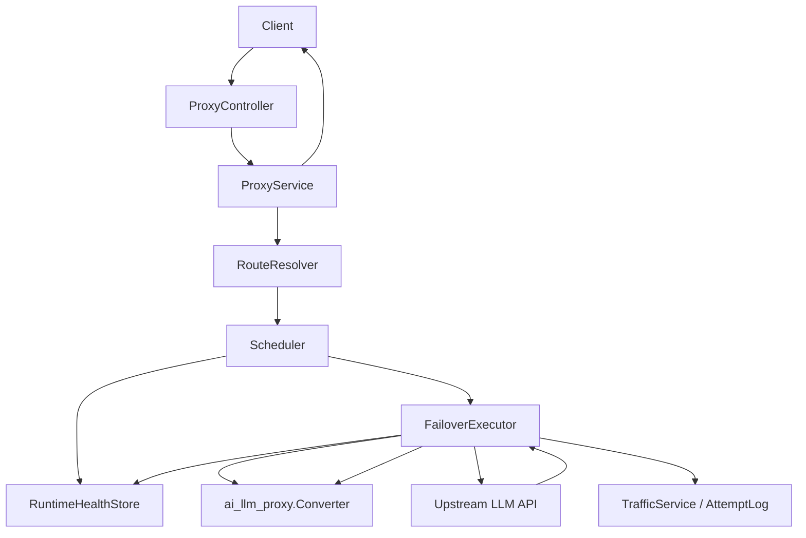

# icoo_llm_bridge 与 ccx 对比及优化计划

报告日期：2026-05-17

## 1. 目标与范围

本文用于指导 `icoo_llm_bridge` 后续优化。分析范围包括：

- `ccx` 已生成分析报告：`ccx/docs/llm-proxy-protocol-analysis.md`
- `ccx/backend-go` 中的调度、协议转换、failover、流式处理、指标和日志模块
- `icoo_llm_bridge` 现有设计文档：`docs/01` 到 `docs/06`
- `icoo_llm_bridge` 当前核心实现：`cmd/bridge`、`internal/app`、`internal/router`、`internal/controller`、`internal/service`、`internal/repository`、`internal/utils/ai_llm_proxy`

本文不是把 `ccx` 原样迁移到 `icoo_llm_bridge` 的方案，而是提取 `ccx` 在生产代理运行时上的成熟能力，并在 `icoo_llm_bridge` 已有分层、依赖注入、数据库模型和管理 API 基础上渐进落地。

## 2. 总体结论

`icoo_llm_bridge` 的工程边界比 `ccx` 更清晰：它已经形成 `cmd -> app.Container -> router/controller -> service -> repository -> model` 的依赖方向，协议转换工具包 `internal/utils/ai_llm_proxy` 也基本保持了无 Gin、无 GORM、无业务层反向依赖的纯工具属性。这一点应该保留。

`ccx` 的优势主要不在分层，而在代理运行时能力：多渠道调度、多 BaseURL、多 Key、故障分类、熔断恢复、流式预检测、渠道生命周期日志、Trace 亲和、模型能力过滤和更完整的协议入口。这些能力是 `icoo_llm_bridge` 当前缺口最大的部分。

优化方向应当是：

1. 先修正 `icoo_llm_bridge` 现有三协议代理的正确性和文档一致性。
2. 再补全 Anthropic、OpenAI Chat、OpenAI Responses 三者之间的转换矩阵。
3. 然后扩展 Provider 运行时模型，使一个 Provider 可以拥有多个 BaseURL 和多个 API Key。
4. 最后引入调度、failover、熔断、流式预检测、指标和请求生命周期日志。

短期不要急于扩展 Gemini、Images 或复杂前端能力。先把三协议、多上游、高可用代理链路做稳。

## 3. icoo_llm_bridge 当前设计概览

当前请求链路可以概括为：

```text
Client
  -> Gin endpoint / NoRoute dynamic endpoint
  -> ProxyController
  -> ProxyService
  -> RouteResolver
  -> ai_llm_proxy.Converter
  -> one Provider base_url + one Provider api_key
  -> upstream HTTP API
  -> ai_llm_proxy.Converter
  -> TrafficRecord
  -> Client
```

现有设计的主要优点：

| 方面 | 当前表现 |
| --- | --- |
| 工程分层 | `Container` 作为组合根，Controller、Service、Repository 职责相对清晰 |
| 数据模型 | 已有 Provider、ProviderModel、RoutingRule、APIKey、IngressEndpoint、TrafficRecord |
| 协议边界 | `internal/utils/ai_llm_proxy` 不依赖 Gin/GORM/Repository，适合作为底层转换包 |
| 鉴权 | API Key 有 hash 校验和 scope，已区分 `admin` 与 `proxy` |
| 请求追踪 | 生成 `X-ICOO-Request-ID`，并记录请求流量 |
| 路由 | 支持 `provider/model` 直连和 RoutingRule 匹配 |
| 配置 | TOML 配置、SQLite 持久化、默认内置入口已经具备 |

当前主要限制：

| 方面 | 限制 |
| --- | --- |
| 协议范围 | 只支持 `anthropic`、`openai-chat`、`openai-responses` 三种协议 |
| 转换矩阵 | 三协议之间并未完整互转，部分方向明确返回未实现 |
| Provider 模型 | 一个 Provider 只有一个 `BaseURL` 和一个 `APIKeyCipher` |
| 调度能力 | 当前按直连或规则选出单一路由，没有候选集、优先级、健康状态或权重调度 |
| 高可用 | 没有跨 Provider、BaseURL、Key 的 retry/failover |
| 熔断恢复 | 没有运行时失败计数、熔断、半开探测、自动恢复 |
| 流式稳健性 | 收到上游 event-stream 后会先写响应头，再做流式转换；转换失败时客户端状态已经不可回滚 |
| 观测能力 | 有 TrafficRecord，但还没有类似 ccx 的渠道级生命周期日志、运行时指标和失败分类 |
| 运行时缓存 | 路由和动态 endpoint 每次查库，尚无可控的内存快照和刷新机制 |

## 4. 与 ccx 的核心对比

| 维度 | ccx | icoo_llm_bridge 当前状态 | 优化判断 |
| --- | --- | --- | --- |
| 架构分层 | handler 中承载较多代理运行时逻辑，工程边界相对粗 | MVC + Service + Repository + 手写 DI，边界更清楚 | 保留 icoo 分层，不照搬 ccx handler 组织方式 |
| 对外协议入口 | Messages、Chat、Responses、Gemini、Images、Models | Messages、Chat、Responses | 先稳定三协议，再考虑 Gemini 和 Images |
| 上游协议模型 | `ChannelKind` 表示入口，`serviceType` 表示真实上游协议 | Provider 上有 `Protocol`，RoutingRule 可覆盖 upstream protocol | 可吸收 ccx 的“入口协议”和“上游协议”分离思想 |
| 渠道/Provider 模型 | 一个渠道可配置多 BaseURL、多 Key、模型映射、优先级、routePrefix、能力标记 | 一个 Provider 只有一个 BaseURL、一个 API Key、多个模型 | 需要拆出 endpoint/key 运行时资源池 |
| 路由 | 支持指定渠道、routePrefix、手动覆盖、Promotion、Trace 亲和、优先级、健康降级 | 支持直连 provider/model 和 RoutingRule 优先级匹配 | 需要从“返回单一路由”升级为“生成候选路由计划” |
| Failover | 渠道间、BaseURL 间、Key 间三层 failover | 只有一次 upstream 请求 | 这是最大生产缺口，应分阶段引入 |
| 故障分类 | 区分认证、余额、quota、客户端取消、空流、无效 JSON 等 | 上游请求失败大多统一返回 502 | 需要 FailureClassifier，决定是否重试、禁用 Key、记录失败 |
| 熔断 | 每类入口有独立 metrics manager 和 circuit breaker | 尚无运行时健康状态 | 需要轻量版 runtime health store，再逐步做 breaker |
| 流式处理 | 有 preflight，避免过早写 header；能识别空流和错误流 | 先写 header，再转换流 | 应优先修复，避免错误状态无法表达 |
| 协议转换 | Responses 路径较完整，兼容 Claude、Chat、Gemini、Responses | 三协议转换包结构清晰，但矩阵不完整 | 保持独立 converter 包，补齐矩阵和测试 |
| 会话与 Trace | Responses 有 session / `previous_response_id` / trace affinity | 暂无会话亲和 | 可作为 P2/P3 能力，不应第一阶段做 |
| 观测日志 | 有 channel log、metrics、请求历史、管理 API | 有 TrafficRecord 和 RequestID | 先扩展 TrafficRecord，再补 runtime metric |
| 配置形态 | 以配置文件和内存运行时为中心 | 以 DB + 管理 API 为目标 | 不应回退到纯配置文件，应建设 DB-backed runtime snapshot |
| 测试覆盖 | Responses/转换/failover 有较多测试 | converter 有基础测试，服务级测试仍少 | 需要围绕矩阵、路由、failover、stream 增加测试 |

## 5. 当前三协议转换矩阵

### 5.1 请求转换

| Downstream -> Upstream | Anthropic | OpenAI Chat | OpenAI Responses |
| --- | --- | --- | --- |
| Anthropic | 透传 | 缺失 | 已支持 |
| OpenAI Chat | 已支持 | 透传 | 已支持 |
| OpenAI Responses | 已支持 | 缺失 | 透传 |

### 5.2 非流式响应转换

| Upstream -> Downstream | Anthropic | OpenAI Chat | OpenAI Responses |
| --- | --- | --- | --- |
| Anthropic | 透传 | 已支持 | 已支持 |
| OpenAI Chat | 已支持 | 透传 | 已支持 |
| OpenAI Responses | 已支持 | 已支持 | 透传 |

### 5.3 SSE 流式转换

| Upstream -> Downstream | Anthropic | OpenAI Chat | OpenAI Responses |
| --- | --- | --- | --- |
| Anthropic | 透传 | 已支持 | 已支持 |
| OpenAI Chat | 已支持 | 透传 | 已支持 |
| OpenAI Responses | 已支持 | 已支持 | 透传 |

结论：

- OpenAI Responses 已经是当前最适合作为中间协议的方向。
- OpenAI Chat 作为上游协议时，非流式响应和基础 SSE 文本流已补齐到 Anthropic / OpenAI Responses；复杂 tool call 增量仍是后续增强项。
- 如果短期不准备补齐所有方向，文档、管理界面和路由校验必须明确标注哪些路径可用，避免用户配置出运行时必然失败的链路。

## 6. 应从 ccx 吸收的能力

### 6.1 多层 failover

建议目标链路：

```text
RouteResolver
  -> Scheduler builds RoutePlan
  -> try Provider candidate
  -> try ProviderEndpoint candidate
  -> try ProviderCredential candidate
  -> classify failure
  -> update runtime health
  -> retry or return final error
```

先实现三层资源：

| 层级 | icoo 建议对象 | 行为 |
| --- | --- | --- |
| Provider 间 | `RouteCandidate` | 多个 Provider 可承接同一个 downstream/model |
| BaseURL 间 | `ProviderEndpoint` | 同 Provider 下多个上游地址轮转或优先级选择 |
| Key 间 | `ProviderCredential` | 同 Provider 下多个 Key 轮转、失败降级、恢复 |

### 6.2 调度器

ccx 的 `ChannelScheduler` 证明了代理网关不能只靠静态规则。`icoo_llm_bridge` 可以引入更小的 Scheduler：

```go
type Scheduler interface {
    Plan(ctx context.Context, request RouteRequest) (RoutePlan, error)
}
```

第一版只需要支持：

- RoutingRule priority
- Provider enabled / model enabled
- ProviderEndpoint enabled
- ProviderCredential enabled
- runtime health 过滤
- 同优先级轮询或最少失败优先

后续再加入：

- Trace affinity
- Promotion
- route prefix
- 手动 provider override
- capability-based routing

### 6.3 故障分类

建议引入 `FailureClassifier`，把上游错误分为：

| 分类 | 示例 | 行为 |
| --- | --- | --- |
| `auth` | 401、403、invalid_api_key | 标记 Key 不可用，可切换 Key |
| `quota` | 429、insufficient_quota、rate limit | 可重试其他 Key 或 Provider |
| `upstream_5xx` | 500、502、503、504 | 可重试其他 endpoint/provider |
| `network` | timeout、connection reset、DNS 失败 | 可重试其他 endpoint |
| `bad_request` | 明确的 400 参数错误 | 通常不重试，直接返回客户端 |
| `client_cancelled` | 客户端断开 | 不污染 Provider 健康状态 |
| `empty_stream` | 流式 200 但没有有效事件 | 可重试，且记录流式异常 |
| `conversion_error` | 转换失败 | 多数属于本地配置/实现问题，不应盲目重试 |

### 6.4 流式预检测

当前 `handleStreamResponse` 会先写 header，再调用转换器。一旦转换失败，客户端已收到成功状态，服务端只能记录日志，无法再返回结构化错误。

建议实现 `StreamPreflight`：

- 在写客户端 header 前读取上游前几个 SSE 事件或有限字节。
- 如果发现上游错误事件、空流、无效 JSON、转换器初始化失败，直接返回可表达的错误。
- 如果预检通过，把已读取片段和剩余 reader 合并后继续流式转发。
- 对预检设置最大字节数和最大等待时间，避免阻塞长连接。

### 6.5 运行时指标和生命周期日志

TrafficRecord 适合记录请求结果，但不足以支撑调度和运维判断。建议增加两类信息：

| 类型 | 用途 |
| --- | --- |
| RuntimeHealth | Provider / endpoint / credential 的成功率、失败次数、连续失败、熔断状态、最近错误 |
| ProxyAttemptLog | 一个请求内部每次尝试的 provider、endpoint、key、状态、耗时、失败分类 |

这样管理界面可以展示“为什么选了这个上游”“为什么切换到另一个 Key”“哪个 endpoint 正在熔断”。

## 7. 不应直接照搬 ccx 的部分

| ccx 做法 | 不建议直接照搬的原因 | icoo 建议 |
| --- | --- | --- |
| handler 内聚合大量代理运行时逻辑 | 会破坏 icoo 已有 Service/Repository 边界 | 把调度、执行、转换、记录拆成 Service 内部组件 |
| 配置文件为主要渠道管理入口 | icoo 已经走 DB + 管理 API 方向 | 建设 DB-backed runtime snapshot |
| provider 接口以 Claude Messages 为中心 | icoo 目标是三协议对等转换 | 保持协议中立的 converter/adapter 接口 |
| 一次性引入所有入口 | 范围过大，容易拖慢三协议稳定化 | 先三协议，后 Gemini/Images |
| 复杂 Trace/Promotion 全量复制 | 早期收益低，测试成本高 | 等基础 failover 和健康状态稳定后再做 |

## 8. 建议目标架构

### 8.1 核心对象

建议逐步演进为以下对象模型：

| 对象 | 职责 |
| --- | --- |
| `Provider` | 供应商/协议/模型目录的逻辑主体 |
| `ProviderModel` | Provider 支持的模型及能力声明 |
| `ProviderEndpoint` | 一个 Provider 下的 BaseURL、权重、优先级、代理、健康状态 |
| `ProviderCredential` | 一个 Provider 下的 API Key、状态、失败原因、恢复时间 |
| `RoutingRule` | downstream protocol + model pattern 到候选 Provider/模型的规则 |
| `RouteCandidate` | 一次请求可尝试的 Provider + endpoint + credential + model |
| `RoutePlan` | 按调度结果排序的候选尝试列表 |
| `RuntimeHealthStore` | 内存健康状态，必要时异步落库 |
| `FailoverExecutor` | 执行候选尝试、错误分类、重试和最终响应 |
| `StreamPreflight` | 流式响应写 header 前的安全检查 |

### 8.2 模块关系



### 8.3 依赖边界

保持以下边界：

- `utils/ai_llm_proxy` 继续不依赖 Gin、GORM、Repository、Service。
- `repository` 只负责数据访问，不做调度策略。
- `service/routing` 负责构造候选集，不直接发 HTTP。
- `service/proxy` 负责编排请求生命周期。
- `service/runtime` 或 `service/health` 负责内存健康状态和熔断状态。
- `controller` 只解析 HTTP 入参和写响应，不承载 failover 细节。

## 9. 分阶段优化计划

### Phase 0：正确性收敛与文档对齐

目标：不改变大结构，先减少当前运行风险。

建议任务：

- 明确三协议转换矩阵，把已支持、未支持、透传方向写入 README 和管理界面提示。
- 对 `ProxyService` 增加 upstream 错误响应处理策略：上游非 2xx 错误不应总是进入正常响应转换。
- 拆分普通请求 timeout 与流式请求 timeout，避免 `WriteTimeout` 直接限制长流式响应。
- 检查响应头复制策略，读取并重写 body 后不要透传不再匹配的 `content-encoding`、`content-length` 等头。
- 修正更新 Provider 时可能覆盖 `CreatedAt` 的风险。
- 对动态 endpoint / provider / model / routing rule 增加可刷新快照，避免每次请求重复查库。
- 为 `chain_log_bodies` 增加更明确的脱敏和生产默认策略。

交付标准：

- 当前三协议可用路径有明确测试。
- 不可用转换方向返回稳定、可理解的错误。
- 流式请求不会被普通写超时误杀。
- 文档与代码行为一致。

### Phase 1：补齐三协议转换矩阵

目标：让 Anthropic、OpenAI Chat、OpenAI Responses 在非流式和流式场景下形成可控矩阵。

建议任务：

- 优先以 Responses 作为中间语义补齐缺失方向。
- 请求缺失方向：
  - Anthropic -> OpenAI Chat
  - OpenAI Responses -> OpenAI Chat
- 已补齐响应方向：
  - OpenAI Chat -> Anthropic
  - OpenAI Chat -> OpenAI Responses
- 已补齐基础流式方向：
  - OpenAI Chat stream -> Anthropic stream
  - OpenAI Chat stream -> OpenAI Responses stream
- 为每个方向建立最小 fixtures，覆盖 text、tool call、usage、finish reason、empty content、error body。
- 对转换失败错误做稳定错误码或错误类型，便于上层判断是否可重试。

交付标准：

- 3x3 请求、非流响应、流式矩阵均有单元测试。
- 每个转换方向在 README 中有支持状态。
- tool call 和 usage 不要求第一版完全无损，但必须明确降级规则。

### Phase 2：Provider 运行时资源池

目标：从“一个 Provider 一条上游链路”升级到“一个 Provider 管理多个 endpoint 和 key”。

建议任务：

- 新增 `provider_endpoints`：
  - `id`
  - `provider_id`
  - `base_url`
  - `priority`
  - `weight`
  - `enabled`
  - `proxy_url`
  - `custom_headers`
  - `created_at`
  - `updated_at`
- 新增 `provider_credentials`：
  - `id`
  - `provider_id`
  - `name`
  - `key_hash`
  - `key_cipher`
  - `enabled`
  - `disabled_reason`
  - `last_failed_at`
  - `recover_after`
  - `created_at`
  - `updated_at`
- 保留 Provider 上的 `BaseURL` / `APIKeyCipher` 一段兼容期，并提供迁移逻辑。
- `RouteResolver` 不再只返回一个 `domain.Route`，而是返回候选 Provider/模型集合。
- 引入 runtime snapshot，把 Provider、Model、Rule、Endpoint、Credential 组合成只读快照。

交付标准：

- 旧数据可自动迁移为默认 endpoint 和 credential。
- 一个 Provider 下多个 BaseURL / Key 可通过管理 API 配置。
- 请求可以在同 Provider 的 endpoint/key 之间选择。

### Phase 3：调度、Failover 与熔断

目标：建立生产代理的核心高可用能力。

建议任务：

- 新增 `Scheduler`，把规则匹配结果转为排序后的 `RoutePlan`。
- 新增 `FailoverExecutor`，执行候选尝试列表。
- 新增 `FailureClassifier`，按错误类型决定是否重试、是否禁用 Key、是否污染 Provider 健康。
- 新增轻量 `RuntimeHealthStore`：
  - 连续失败次数
  - 最近成功/失败时间
  - 最近错误类型
  - 熔断状态：closed / open / half_open
- 第一版熔断策略可以简单：
  - 连续失败超过阈值进入 open
  - 到达恢复时间后进入 half_open
  - half_open 成功后 closed，失败后继续 open
- 对每次请求记录 attempt 日志，关联同一个 request_id。

交付标准：

- 单个 endpoint 失败时能切换到同 Provider 其他 endpoint。
- 单个 Key 认证失败时能切换到其他 Key，并标记该 Key 状态。
- Provider 5xx 或网络失败时能尝试下一个候选 Provider。
- 客户端取消不增加上游失败计数。
- 管理端可以看到健康状态和最近失败原因。

### Phase 4：流式可靠性与可观测性

目标：让流式代理具备和普通请求同等级的可诊断性。

建议任务：

- 实现 `StreamPreflight`，写客户端 header 前检查上游首批事件。
- 支持空流、错误事件、无效 JSON 的失败分类。
- 在流式转换中累计 usage、首 token 延迟、总耗时、结束原因。
- 对流式请求记录 attempt 级状态：
  - upstream_connected
  - first_event_received
  - first_downstream_chunk_sent
  - completed
  - client_cancelled
  - conversion_failed
- 对非流式“伪流式”响应，例如 Chat `stream=true` 但上游返回非流，也建立明确记录。

交付标准：

- 上游空流不会以成功状态静默返回。
- 上游错误流可以转换为对应 downstream 协议错误。
- 预检失败时客户端收到正确 HTTP 状态。
- 管理端能区分上游失败、转换失败、客户端中断。

### Phase 5：协议扩展与能力路由

目标：在三协议稳定后扩展产品能力。

候选方向：

- Gemini 原生协议入口和上游协议。
- Images 入口。
- `/v1/models` 聚合。
- 模型能力声明：vision、tools、reasoning、json mode、stream-only。
- capability-based routing：根据请求是否含图片、工具、reasoning 参数选择 Provider。
- Responses session / `previous_response_id` / trace affinity。

交付标准：

- 新协议必须先进入 converter 支持矩阵和测试矩阵，再开放管理配置。
- 能力路由不能只靠模型名字符串判断，应有 ProviderModel capability 字段。

## 10. 优先级清单

### P0：必须先做

- 对齐协议转换矩阵文档和真实行为。
- 修复流式超时策略，避免长 SSE 被普通写超时截断。
- 上游非 2xx 错误响应不要盲目走成功响应转换。
- 写响应体后清理不再可靠的压缩和长度类响应头。
- 增加 stream preflight 的最小实现。
- 增加 converter 矩阵测试。

### P1：核心增强

- 新增 ProviderEndpoint 和 ProviderCredential。
- 引入 runtime snapshot，减少每请求查库。
- 引入 RouteCandidate / RoutePlan。
- 实现同 Provider 多 endpoint/key failover。
- 实现跨 Provider failover。
- 增加 FailureClassifier 和轻量 RuntimeHealthStore。

### P2：增强体验和扩展

- 管理端展示 Provider / endpoint / key 健康状态。
- 增加 attempt 日志和请求链路详情。
- 支持 Trace affinity 和手动 provider override。
- 增加 Gemini / Images。
- 增加模型能力路由。

## 11. 建议文件落点

建议新增或调整以下模块：

| 路径 | 用途 |
| --- | --- |
| `internal/model/entity/provider_endpoint.go` | endpoint 持久化模型 |
| `internal/model/entity/provider_credential.go` | key 持久化模型 |
| `internal/model/domain/route_plan.go` | RouteCandidate / RoutePlan |
| `internal/service/routing/scheduler.go` 或 `internal/service/scheduler.go` | 调度策略 |
| `internal/service/proxy/failover_executor.go` 或当前 `service` 下等价文件 | failover 执行 |
| `internal/service/proxy/failure_classifier.go` | 错误分类 |
| `internal/service/runtime/health_store.go` | 运行时健康状态 |
| `internal/service/proxy/stream_preflight.go` | 流式预检测 |
| `internal/repository/provider_endpoint_repository.go` | endpoint 数据访问 |
| `internal/repository/provider_credential_repository.go` | credential 数据访问 |
| `internal/utils/ai_llm_proxy/*_test.go` | 转换矩阵测试 |

如果当前项目暂时不想拆目录，可以先放在现有 `internal/service` 包内，但要保持接口边界，避免 `proxy_service.go` 继续膨胀。

## 12. 验收标准

### 12.1 转换验收

| 类型 | 验收标准 |
| --- | --- |
| 请求转换 | 3x3 矩阵每个方向有测试；未支持方向必须不存在或明确标注，不允许文档声称已支持 |
| 非流响应 | text、usage、finish reason、error response 有测试 |
| 流式响应 | 首事件、delta、tool、usage、done、错误事件、空流有测试 |
| 兼容性 | 同协议透传不破坏 body 和关键 header |

### 12.2 路由与 failover 验收

| 场景 | 预期 |
| --- | --- |
| provider/model 直连 | 命中指定 Provider 和模型 |
| RoutingRule 命中 | 按 priority 选择候选 |
| endpoint 网络失败 | 自动尝试下一个 endpoint |
| key 认证失败 | 标记当前 key，尝试下一个 key |
| provider 5xx | 尝试下一个候选 Provider |
| 请求参数错误 | 不重试，直接返回客户端 |
| 客户端取消 | 不污染上游健康状态 |
| 全部候选失败 | 返回最后一个最有意义的错误，并记录所有 attempts |

### 12.3 流式验收

| 场景 | 预期 |
| --- | --- |
| 上游正常 SSE | 客户端收到正确 downstream 协议事件 |
| 上游立即错误 | 客户端收到正确错误状态，不伪装成功流 |
| 上游空流 | 触发可记录的 empty_stream 错误 |
| 转换器失败 | 记录 conversion_error，并暴露 request_id |
| 客户端中断 | 尽快停止上游读取，不记录为 Provider 失败 |

### 12.4 观测验收

| 项目 | 预期 |
| --- | --- |
| TrafficRecord | 记录最终结果、耗时、usage、route source |
| AttemptLog | 记录每次尝试的 provider、endpoint、credential、错误分类、耗时 |
| RuntimeHealth | 管理端可查看 endpoint/key/provider 的状态 |
| RequestID | 所有日志、响应头、TrafficRecord、AttemptLog 使用同一个 request_id |

## 13. 推荐实施顺序

1. 完成 Phase 0：文档对齐、错误响应、timeout、header、最小 stream preflight。
2. 完成 Phase 1：补齐转换矩阵和测试。
3. 做数据库迁移：ProviderEndpoint、ProviderCredential、旧字段兼容迁移。
4. 引入 runtime snapshot 和 RoutePlan，但先只选择第一个候选，降低改动风险。
5. 在 RoutePlan 基础上加入 endpoint/key failover。
6. 加入 FailureClassifier 和 RuntimeHealthStore。
7. 加入跨 Provider failover、熔断和 half-open。
8. 扩展管理端状态展示和 attempt 日志。
9. 三协议稳定后再进入 Gemini、Images、capability routing。

## 14. 关键风险

| 风险 | 影响 | 缓解 |
| --- | --- | --- |
| 过早扩大协议范围 | 三协议本身不稳定，问题定位困难 | Gemini/Images 放到 Phase 5 |
| failover 与转换错误混淆 | 本地转换 bug 可能触发无意义重试 | FailureClassifier 区分 conversion_error |
| 流式 header 过早写出 | 客户端收到错误成功状态 | Phase 0 引入 stream preflight |
| Key 明文存储策略不清 | 管理便利与安全冲突 | 明确 reveal 需求、加密方案和权限边界 |
| 每请求查库 | 高并发下性能和一致性不可控 | runtime snapshot + 显式刷新 |
| `proxy_service.go` 继续膨胀 | 后续维护困难 | 新增 Scheduler、Executor、Preflight、Classifier 组件 |

## 15. 最小可执行里程碑

如果只选择一个最小版本，建议定义为：

```text
MVP-HA:
  - 三协议转换矩阵文档与测试完整
  - Provider 支持多个 endpoint 和多个 credential
  - 同 Provider 内 endpoint/key failover 可用
  - 上游错误分类可用
  - 流式 preflight 可用
  - TrafficRecord + AttemptLog 能还原一次请求的所有尝试
```

达到 MVP-HA 后，`icoo_llm_bridge` 才具备替代单点代理脚本、进入多上游生产代理的基础。

## 16. 参考代码位置

`icoo_llm_bridge`：

- `cmd/bridge/main.go`
- `internal/app/container.go`
- `internal/router/router.go`
- `internal/controller/proxy_controller.go`
- `internal/service/proxy_service.go`
- `internal/service/route_resolver.go`
- `internal/utils/ai_llm_proxy/converter.go`
- `internal/utils/ai_llm_proxy/README.md`
- `internal/model/entity/provider.go`
- `internal/repository/seed.go`

`ccx`：

- `ccx/docs/llm-proxy-protocol-analysis.md`
- `ccx/backend-go/main.go`
- `ccx/backend-go/internal/scheduler/channel_scheduler.go`
- `ccx/backend-go/internal/handlers/common/multi_channel_failover.go`
- `ccx/backend-go/internal/handlers/common/upstream_failover.go`
- `ccx/backend-go/internal/handlers/common/stream.go`
- `ccx/backend-go/internal/converters/factory.go`
- `ccx/backend-go/internal/providers/responses.go`
- `ccx/backend-go/internal/metrics/channel_metrics.go`
- `ccx/backend-go/internal/metrics/channel_log.go`
