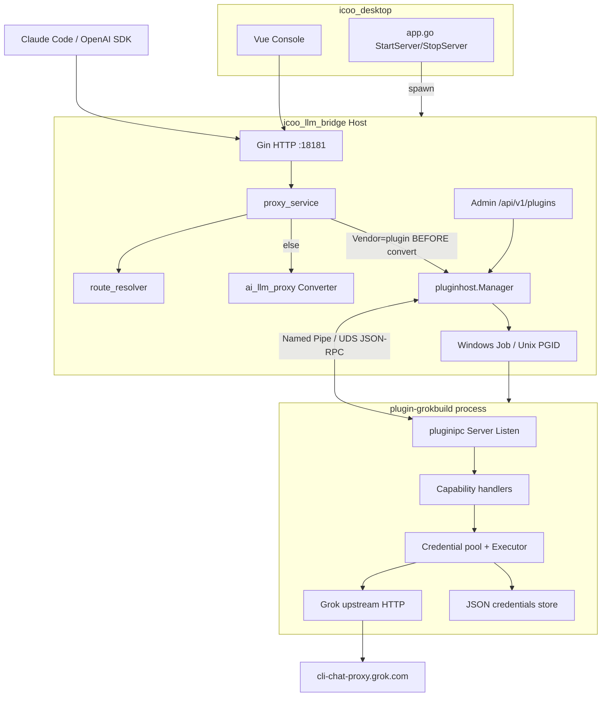

# 模块化进程插件架构 + GrokBuild 代理插件设计

| 字段 | 值 |
|------|-----|
| **Title** | Modular Process-Plugin Architecture + GrokBuild Proxy Plugin for icoo_proxy |
| **Author** | Grok Design Agent |
| **Date** | 2026-07-16 |
| **Status** | Draft（Rev 3 — Issues 16–18：raw-followup 原子性 / header allowlist / stream.open 非 2xx） |
| **Audience** | icoo_proxy 核心/桌面端维护者、插件作者 |
| **Primary language** | 中文（代码标识符、包路径、协议名保持英文） |

---

## Overview / 概述

`icoo_proxy` 当前以双二进制形态交付：`icoo_desktop.exe`（Wails + Vue）与 `bridge.exe`（`icoo_llm_bridge`，Gin/GORM/SQLite）。桥接层已实现 OpenAI Chat Completions、OpenAI Responses、Anthropic Messages 三类下游入口，并通过供应商（Provider）+ 路由规则（RoutingRule）+ 协议转换（`internal/utils/ai_llm_proxy`）将请求转发到 HTTP 上游。

本设计将 monorepo 拆解为 **Host（插件宿主）+ Process Plugin（进程级插件）+ Shared IPC SDK** 三层边界，使可选能力（首例为 Grok Build 兼容代理）以独立 OS 进程运行，通过统一 IPC（Windows Named Pipe / Unix Domain Socket）与宿主交互。GrokBuild 能力以 **可选外部能力插件** 形式交付，**不进入核心路径**，并保留法律/运营免责声明。

目标状态：

1. 现有 HTTP 代理路径零破坏（默认行为不变）。
2. v1 仅落地一套真实插件：`plugin-grokbuild`（能力分 **MVP-A / MVP-B**，见 KD-15）。
3. Desktop 仍只负责启动/停止 bridge 与配置 UX；**bridge 作为唯一插件宿主**。
4. IPC 支持请求/响应与 LLM 流式分片；大 body 使用 **JSON 控制帧 + 原始 body 跟帧**，避免 base64 撑破帧上限。
5. 保留 **HTTP sidecar 双路径**（`Vendor=custom` + 本机 grokbuild-proxy）：插件滞后/上游变更时可继续用。

---

## Background & Motivation / 背景与动机

### 当前状态

| 组件 | 路径 | 职责 |
|------|------|------|
| Bridge 组合根 | `icoo_llm_bridge/internal/app/container.go` | `NewContainer` / `Start` / `Shutdown` / `Close` |
| 代理热路径 | `icoo_llm_bridge/internal/service/proxy_service.go` | 鉴权 → 路由解析 → **ConvertRequest** → HTTP 上游 → 流/非流回写 |
| 路由 | `icoo_llm_bridge/internal/service/route_resolver.go` | Provider 直连模型名 / RoutingRule 匹配 |
| 供应商模型 | `icoo_llm_bridge/internal/model/entity/provider.go` | `Protocol` + `Vendor` + `BaseURL` + `APIKeyCipher` |
| Vendor 枚举 | `icoo_llm_bridge/internal/constants/vendor.go` | `openai` / `deepseek` / `glm` / `anthropic` / `custom`（**尚无** `plugin`） |
| Traffic | `icoo_llm_bridge/internal/model/entity/traffic_record.go` | `RouteName` / `RouteSource` / `UpstreamProtocol` / tokens 等（**无** `provider_name` 列） |
| Desktop 子进程 | `icoo_desktop/app.go` | `StartServer` / `StopServer`，HTTP health 探测（仅 bridge 一层） |
| 打包 | `build-all.ps1` → `icoo_proxy/` | `icoo_desktop.exe` + `bridge.exe` |
| 模块图 | 仓库根 **无** `go.mod` / `go.work` | 仅 `icoo_llm_bridge`、`icoo_desktop` 两模块 |

### 痛点

1. **能力耦合风险**：若把 Grok Build OAuth、凭据池、CLI 协议适配直接并入 bridge 进程，会放大崩溃面、密钥面与依赖复杂度，并污染「通用 HTTP 供应商网关」的产品边界。
2. **可选能力需要隔离**：GrokBuild 是非官方、依赖不稳定上游 CLI 协议的能力；必须可禁用、可崩溃隔离、可单独升级。
3. **语言/发布节奏**：进程插件允许不同发布节奏与可选二进制体积（不装插件则不携带该依赖）。
4. **Desktop 已有子进程管理经验**，但仅针对 bridge 一层；需要可推广的插件生命周期，并处理 Windows 进程树回收。

### 参考系统：grokbuild-proxy

本地克隆：`C:\Users\issue\AppData\Local\Temp\grokbuild-proxy`  
模块：`github.com/GreyGunG/grokbuild-proxy`（MIT，Go 1.26.5）

职责摘要（见其 `DESIGN.md`）：

- Anthropic Messages / OpenAI Chat & Responses → Grok Build Responses（`cli-chat-proxy.grok.com`）
- OAuth Device Login、多凭据池、sticky/failover、thinking/tools/SSE 转换
- 本地 JSON 原子存储、Admin UI、loopback 默认安全模型

**关键约束**：必须作为可选插件；文档与 UI 需明确非官方、账号风险自负；不得将 grokbuild 的 Admin UI 硬塞进 icoo 核心。

---

## Goals & Non-Goals / 目标与非目标

### Goals

1. 定义 monorepo 模块边界与进程插件契约（manifest、发现、生命周期、版本协商、**冻结的 module import 路径**）。
2. 实现跨平台统一 IPC 抽象：Windows `go-winio` Named Pipe；Linux/macOS Unix Domain Socket。
3. 选定并落地 framing：长度前缀 + JSON-RPC 2.0（含流式扩展 + **大 body 原始跟帧**）。
4. 以 **方案 C（Hybrid）** 交付首个插件 `plugin-grokbuild`；同时文档化 **方案 B 为永久支持的逃生/并行路径**。
5. Bridge 作为 Host：路由可将特定 Provider 指向插件（`Vendor=plugin` + `PluginID`）。
6. 配置（TOML）、Admin API（插件列表/状态）、**Admin Check/FetchModels/Chat 对插件 Provider 的兼容行为**、可观测性与回滚方案完备。
7. 给出可立即执行的 Development Plan 与 PR Plan。

### Non-Goals（v1）

- 多租户 SaaS 插件市场、远程插件下载与签名商店。
- 插件内嵌完整 grokbuild Admin SPA 到 icoo Desktop（v1：CLI import + 可选禁用的 loopback Device Login）。
- 用 gRPC/Protobuf 作为 v1 主协议（可列为演进项）。
- 改写现有 `ai_llm_proxy` 协议矩阵以「替代」Grok 专用 thinking 语义（Grok 特有逻辑留在插件内）。
- 让 Desktop 直接托管插件进程（避免双宿主状态分裂）。
- 支持非 Go 插件的完整 SDK 生成（契约可文档化；v1 SDK 仅 Go）。
- **MVP-A 不要求** tools / thinking signature 完整 parity（见 KD-15 / Phase 5）。

---

## Key Decisions / 关键决策

| # | 决策 | 理由 |
|---|------|------|
| **KD-1** | **Plugin Host = `icoo_llm_bridge`**；Desktop 只管理 bridge | 代理热路径、路由、流量记账、鉴权已在 bridge；插件生命周期与请求同进程树；headless 可用。 |
| **KD-2** | **进程级插件 + IPC**，非 in-process Go `plugin` 包，也非 in-process 库直链 | 崩溃隔离、可选分发、密钥隔离；in-process 库会把 Grok panic 拖垮 bridge（见 Alternatives）。 |
| **KD-3** | **传输**：Windows Named Pipe（`go-winio`）；Unix pathname UDS | 本地高性能、无端口冲突；默认仅本机 ACL。 |
| **KD-4** | **Framing = 4-byte BE length + JSON-RPC 2.0**；大 payload 用 **控制 JSON 帧 + raw body 跟帧** | 小消息可调试；大 body 避免 base64 膨胀击穿帧上限（见 §4.2）。 |
| **KD-5** | **GrokBuild 主路径 = 方案 C（Hybrid 真插件）**；**方案 B HTTP sidecar 永久保留为并行路径** | C 符合插件架构；B（`Vendor=custom` + loopback BaseURL）在插件滞后/上游破坏时仍可用，不是“仅调试”。 |
| **KD-6** | **路由挂载主键：`Vendor=plugin` + `PluginID`**；`BaseURL` 建议占位 `plugin://<id>` | 最小侵入；`proxy_service` 在 **ConvertRequest 之前** 分支。 |
| **KD-7** | **v1 插件路径跳过 bridge converter**：透传 **下游原始 body**；插件声明 `supported_ingress` | 避免双重转换；ingress 不在集合内 → HTTP 400 / IPC `-32002`。 |
| **KD-8** | **凭据与 OAuth 数据留在插件 data_dir**，不进 bridge SQLite | 降低密钥扩散。 |
| **KD-9** | **默认关闭插件**；显式 `enabled=true` 才 spawn | 本地优先、合规可选。 |
| **KD-10** | **流式：JSON-RPC 通知 + 严格 open-result-before-chunk 序** | 防止 chunk 先于 `stream_id`；Host Client API 见 §4.7。 |
| **KD-11** | **v1 OAuth UX：插件 CLI `login`/`import` + 默认关闭的 loopback Device Login**；Desktop WebView 后续 | 解阻 PR 凭据引导；不阻塞 bridge。 |
| **KD-12** | **`models.list` 默认按需**；可选 Admin「同步到 `provider_models`」按钮，**禁止自动静默写入** | 避免污染 catalog；用户可控。 |
| **KD-13** | **每插件最大并发流默认 32**（可配置 `max_concurrent_streams`） | 防 FD/内存耗尽；超限返回 503。 |
| **KD-14** | **模块布局（最小 churn）**：`pluginipc` 放在 **`icoo_llm_bridge/pkg/pluginipc`**（同一 `module icoo_llm_bridge`）；插件独立 `go.mod` + `replace` | 仓库无 root go.mod；避免 v1 强制引入 `go.work`/第三模块与 CI 大改。 |
| **KD-15** | **Grok 功能冻结分层：MVP-A / MVP-B** | 防止 PR-09/10 低估 thinking+tools；GA 打包以 MVP-A 为准。 |
| **KD-16** | **Windows Job Object `KILL_ON_JOB_CLOSE` + Unix process group** | bridge 被强杀时回收插件孙进程，防孤儿耗额度。 |
| **KD-17** | **Shutdown 顺序：先 `Server.Shutdown` 排空 HTTP，再 `plugin.shutdown`，最后强制 Kill** | 避免先杀插件导致 in-flight SSE 中途截断。 |
| **KD-18** | **Endpoint 随机后缀强制**；插件 **Listen**、Host **Dial** | 防 stale pipe/socket 冲突与权限混淆。 |
| **KD-19** | **包命名：Host 侧 `internal/pluginhost` + `internal/service/plugin_proxy.go`**（不单独建 `plugintransport` 包） | 消除树与 PR 命名漂移；传输适配即 proxy 分支。 |

---

## Proposed Design / 详细设计

### 1. 目标 monorepo 结构与模块图（冻结）

```text
icoo_proxy/
├── icoo_llm_bridge/                    # module: icoo_llm_bridge  (Go 1.23)
│   ├── go.mod
│   ├── pkg/
│   │   └── pluginipc/                  # 共享 IPC SDK（同模块导出）
│   │       ├── framing.go
│   │       ├── rpc.go
│   │       ├── stream.go
│   │       ├── client.go
│   │       ├── server.go
│   │       ├── body_xfer.go            # raw body 跟帧
│   │       ├── transport_windows.go
│   │       ├── transport_unix.go
│   │       └── manifest.go
│   └── internal/
│       ├── pluginhost/                 # 发现、spawn、Job/PGID、握手、心跳
│       ├── service/
│       │   ├── proxy_service.go
│       │   └── plugin_proxy.go         # 插件热路径（非独立 plugintransport 包）
│       ├── config/
│       └── app/container.go
├── icoo_desktop/                       # module: icoo_desktop
├── plugins/
│   └── grokbuild/                      # module: icoo_plugin_grokbuild
│       ├── go.mod
│       ├── cmd/plugin-grokbuild/
│       ├── internal/                   # 改编自 grokbuild-proxy（裁剪）
│       ├── plugin.manifest.json
│       └── README.md + DISCLAIMER.md
├── docs/
└── build-all.ps1
```

#### 1.1 模块所有权与 import 路径（Issue 1 关闭）

| 包 | Module | Import path |
|----|--------|-------------|
| IPC SDK | `icoo_llm_bridge` | `icoo_llm_bridge/pkg/pluginipc` |
| Host | `icoo_llm_bridge` | `icoo_llm_bridge/internal/pluginhost` |
| Grok 插件 | `icoo_plugin_grokbuild` | 插件内部路径；**不**被 bridge import |

**插件 `go.mod` 示例：**

```go
module icoo_plugin_grokbuild

go 1.23

require icoo_llm_bridge v0.0.0

replace icoo_llm_bridge => ../../icoo_llm_bridge
```

插件仅依赖 `icoo_llm_bridge/pkg/pluginipc`（及自身改编代码）。**禁止** import `icoo_llm_bridge/internal/...`。

**不在 v1 引入 root `go.work`**（KD-14）。工程师验收命令：

```text
# Host + SDK
cd icoo_llm_bridge && go test ./pkg/pluginipc/... ./internal/pluginhost/...

# Plugin
cd plugins/grokbuild && go test ./...
```

若未来多插件共享压力增大，可再 extract `module icoo_pluginipc` + `go.work`；**非 v1 阻断项**。

**Windows 依赖：** `github.com/Microsoft/go-winio` 加到 `icoo_llm_bridge/go.mod`；`transport_windows.go` 使用 build tag `windows`。

### 2. 逻辑架构



**并行逃生路径（方案 B，永久支持）：**

```text
Client → bridge → Vendor=custom BaseURL=http://127.0.0.1:<grokbuild-port>
                 → 外部 grokbuild-proxy 二进制（用户自管）
```

### 3. 谁托管插件？

**决定：bridge 托管（KD-1）。**

| 方案 | 优点 | 缺点 | 结论 |
|------|------|------|------|
| Desktop 托管插件 | 与 bridge 启动对称 | 配置双源；headless 不可用 | 否 |
| Bridge 托管插件 | 与代理同生命周期；流量一致 | 需进程树管理 | **采用** |
| 外部自管 sidecar | 运维灵活、可 curl | 非 IPC；双鉴权 | **永久并行路径 B** |

Desktop 变更 v1：**最小**——可选打包 `plugin-grokbuild.exe`；UI 可后续加插件页。

### 4. IPC 抽象与协议

#### 4.1 Transport 接口

```go
// icoo_llm_bridge/pkg/pluginipc/transport.go
package pluginipc

import (
    "context"
    "net"
)

type ListenConfig struct {
    // Windows: \\.\pipe\icoo-plugin-<plugin_id>-<random8>
    // Unix:    <data_dir>/plugins/<id>/run-<random8>.sock
    Endpoint string
    // Windows only: security descriptor (see §4.1.1)
    SecurityDescriptor string
}

type DialConfig struct {
    Endpoint string
}

func Listen(ctx context.Context, cfg ListenConfig) (net.Listener, error)
func Dial(ctx context.Context, cfg DialConfig) (net.Conn, error)
```

**职责：插件 Listen，Host Dial**（KD-18）。Host 生成 `endpoint` + `host_token`，经 CLI/env 传给子进程；Host **从不**在插件 endpoint 上 Listen。

##### 4.1.1 Windows Named Pipe 安全（Issue 8）

默认 `winio.PipeConfig`：

```text
SecurityDescriptor =
  "D:P(A;;GA;;;OW)"   // 仅 Owner（创建者）完全访问；OW = Owner Rights SID
```

实现要求：

1. 使用当前进程用户创建 pipe；**不**对 `Everyone` / `BU`（Users）放行。
2. `MessageMode: false`（byte mode），与 length-prefix 一致。
3. Endpoint **必须**含随机 8-hex 后缀（每次 spawn 新名）；**禁止**固定全局 pipe 名。
4. 集成测试（可文档化为手动/CI 分用户）：同机其他 Windows 用户 Dial 应失败。
5. 同用户恶意进程仍可能连 pipe（本地单操作者模型）→ **第二因子 `host_token`** 必校验。

##### 4.1.2 Unix UDS 安全

1. **仅 pathname socket**（不用 abstract `@`），便于权限与审计。
2. 父目录 `0700`，socket 文件 `0600`；`Listen` 前 `Lstat` 确认目录非 symlink 到他人可控路径（`data_dir` 启动时校验 ownership == 当前 uid）。
3. 启动前 `unlink` stale socket；路径含 `run-<random8>.sock`。
4. 可选：`SO_PASSCRED` 校验 peer uid == self（v1 推荐实现若成本低；否则 token 足够）。

##### 4.1.3 host_token 传递

| 通道 | v1 | 说明 |
|------|----|------|
| CLI `--host-token` | 可选 | 出现在 `ps` 参数列表（同用户可见） |
| Env `ICOO_PLUGIN_TOKEN` | **默认** | 同用户可见；本地威胁模型可接受 |
| 匿名 pipe / stdin 首行 bootstrap | v1.1 优选 | 降低 list 暴露；不阻断 v1 |

Handshake `params.host_token` 必须常量时间比较；错误 → `-32001`，立即关连接。

**残余风险（明示）**：同用户恶意进程可读 env/argv 并伪造 Dial——与 bridge 自身同信任域；不缓解跨用户。

#### 4.2 Framing 与大 body 传输（Issue 2 关闭）

**控制帧（JSON-RPC）：**

```text
+----------------+---------------------------+
| u32 BE length  | UTF-8 JSON payload        |
| (4 bytes)      | length bytes              |
+----------------+---------------------------+
```

**默认 `max_frame_bytes`：**

```text
max_frame_bytes = max(8 MiB, max_request_body_bytes)
```

即与 bridge `MaxRequestBodyBytes`（默认 **64 MiB**）**同源配置**，**不再**取 32 MiB「保守」导致错位。配置项：

- `plugins.max_frame_bytes` 默认 `0` = 跟随 `max_request_body_bytes`
- 仅当显式设置时覆盖

**大 body 策略（强制用于 `proxy.complete` / `proxy.stream.open` 的请求体）：**

1. JSON-RPC params **不含**完整 body 的 base64。
2. 使用 `body_encoding`：

| 值 | 语义 |
|----|------|
| `"inline"` | 仅当 `len(body) ≤ 256 KiB` 时允许 `body` 字段（`[]byte`→base64）；超限 Host 必须改用 raw |
| `"raw-followup"` | JSON 帧后 **紧跟** 一帧：`u32 BE length + raw bytes`（**非 JSON**） |

```text
Host → Plugin:
  [JSON frame: proxy.stream.open params with body_encoding=raw-followup, body_len=N]
  [RAW  frame: N bytes request body]

Plugin → Host (non-stream complete):
  [JSON frame: result with body_encoding=raw-followup|inline, status, headers, body_len?]
  [optional RAW frame]
```

##### 4.2.1 多帧消息原子性（强制，Issue 16）

`raw-followup` 在**同一条多路复用连接**上是一个逻辑消息的两帧，**不是**可被其他 RPC 打断的两个独立消息。

**写路径（Host 与 Plugin 对称）：**

```go
// pkg/pluginipc 必须暴露原子写 API；禁止调用方手写两帧而无锁。
func (c *Conn) WriteMessage(ctrlJSON []byte, rawBody []byte) error {
    c.writeMu.Lock()
    defer c.writeMu.Unlock()
    if err := c.writeFrameLocked(ctrlJSON); err != nil {
        return err
    }
    if rawBody == nil {
        return nil // inline / no attachment
    }
    return c.writeFrameLocked(rawBody) // length-prefix raw bytes；中间不得释放 writeMu
}
```

规则：

1. **JSON 控制帧 + 紧随 RAW 帧 MUST 在同一 `writeMu` 临界区内连续写出**。其间不得插入 `plugin.ping`、其他 `proxy.*`、`stream.chunk` 或任何 notification。
2. 仅 `body_encoding=raw-followup` 且 `body_len>0`（或 result 侧同等字段）时写第二帧；`inline` 只写一帧 JSON。
3. 若第二帧写失败：连接视为 **fatal**（对端 demux 状态不确定）→ 关 conn → Host 将该插件标 unhealthy 并触发 restart；进行中 RPC 全部失败。
4. `stream.chunk` 等单帧 notification 仍各自 `writeMu` 包一帧即可（无 followup）。

**读路径（单 demux goroutine）：**

```text
state = idle
loop:
  frame = ReadFrame()
  if state == idle:
    msg = decodeJSON(frame)
    if msg has body_encoding=raw-followup && body_len > 0:
      state = expect_raw_body(attach_to=msg)   // 暂停把 msg 投递给业务
      continue
    dispatch(msg)  // request/response/notification
  else if state == expect_raw_body(msg):
    // 下一帧 MUST 立即作为 body 附件，禁止先 demux 其他 JSON
    if len(frame) != msg.body_len: protocol error → close conn
    msg.Body = frame
    state = idle
    dispatch(msg)
```

规则：

1. 解析到控制消息且需要 raw 附件后，**下一条 length-prefix 帧 MUST 完整读入并附着到该消息**，然后才 `dispatch`；**禁止**在 expect 状态下把下一帧当新的 JSON-RPC。
2. 若 expect 状态下对端关闭、超时（读超时建议 ≥ request ctx，默认与 `WriteTimeout` 对齐）、或 `body_len` 与帧长不符 → **protocol error，关闭连接**（不猜测恢复）。
3. demux 仍是**单 reader**；原子性靠「写侧不交错 + 读侧 expect 状态机」，不靠额外帧类型魔数（v1）。
4. 并发：多个 `Complete`/`OpenStream` 在应用层并行调用时，其 `WriteMessage` 串行化；对端按序看到完整「控制+body」对，不会把 A 的 body 拼到 B。

**单测要求（Phase 0 / PR-01 验收）：**

- body 刚好低于/高于 256 KiB 切换 encoding；接近 64 MiB raw-followup 成功；故意超限拒绝。
- **两路并发** `Complete(raw-followup)` + 中间插 `Ping`：两端 body 字节与 `id` 一一对应、无交叉。
- 模拟写侧若错误地在两帧间释放锁插入 ping → 读侧应 protocol error 或（若未实现违规写）测试 harness 证明合规 API 不会交错。

流式响应的 chunk 仍用 JSON notification，但 `data` 单片上限 `max_stream_chunk_bytes` 默认 **64 KiB**（避免单帧过大）；大块由插件切分。

**超限映射：**

| 条件 | Host 行为 |
|------|-----------|
| 下游 body > `max_request_body_bytes` | 现有逻辑 HTTP **413** |
| 组装 IPC 帧将超 `max_frame_bytes` | HTTP **413**，message 含 `plugin ipc frame limit` |
| 插件回帧超限 | 关 stream，HTTP **502**，记 traffic error |

#### 4.3 为何 JSON-RPC 2.0

| 选项 | 评价 |
|------|------|
| 原始 ad-hoc JSON | 缺标准错误码与 id 关联 |
| gRPC over UDS | v1 过重 |
| HTTP/2 loopback | 与 winio/UDS 主目标不符；方案 B 已覆盖 HTTP |
| **JSON-RPC 2.0 + length prefix + raw followup** | 可调试 + 大 body 安全 |

#### 4.4 消息形态

```json
{"jsonrpc":"2.0","id":"1","method":"plugin.handshake","params":{...}}
{"jsonrpc":"2.0","id":"1","result":{...}}
{"jsonrpc":"2.0","id":"1","error":{"code":-32001,"message":"unauthorized","data":{...}}}
{"jsonrpc":"2.0","method":"stream.chunk","params":{"stream_id":"...","seq":1,"data":"<base64 ≤64KiB>"}}
```

#### 4.5 生命周期 RPC 与 CLI/env 契约（冻结）

**子进程启动契约（Host 与 PR-08 必须一致）：**

```text
plugin-grokbuild \
  --endpoint <pipe-or-sock> \
  --data-dir <path> \
  --plugin-id grokbuild

Env:
  ICOO_PLUGIN_TOKEN=<random 32 bytes hex>
  ICOO_PLUGIN_LOG=<path optional>
```

可选：`--admin-listen` 仅当配置显式启用。

```mermaid
sequenceDiagram
    participant H as Host (bridge)
    participant P as Plugin Process

    H->>H: gen endpoint + host_token
    H->>P: spawn (Job/PGID) + env token
    P->>P: Listen(endpoint) ACL
    H->>P: Dial + plugin.handshake(token)
    P-->>H: capabilities, supported_ingress, version
    loop every 5s
        H->>P: plugin.ping
        P-->>H: result pong
    end
    H->>P: proxy.stream.open (JSON + optional raw body)
    P-->>H: result {stream_id}   %% MUST complete before any stream.*
    P-->>H: stream.chunk*
    P-->>H: stream.end
    Note over H,P: Shutdown: HTTP drain first, then
    H->>P: plugin.shutdown
    P-->>H: ok
    H->>P: Wait; Kill if timeout
```

| Method | 方向 | 说明 |
|--------|------|------|
| `plugin.handshake` | H→P | 版本、token、capabilities |
| `plugin.ping` | H→P | 心跳 |
| `plugin.get_info` | H→P | 健康、凭据摘要（脱敏） |
| `plugin.shutdown` | H→P | 优雅退出 |
| `plugin.health` | H→P | Admin Check 用 |
| `models.list` | H→P | 模型列表 |
| `proxy.complete` | H→P | 非流式 |
| `proxy.stream.open` | H→P | 开流，**先**回 `stream_id` |
| `stream.chunk` | P→H | 分片（open 响应写完之后） |
| `stream.end` | P→H | 结束 + usage |
| `stream.error` | P→H | 流错误 |
| `stream.cancel` | H→P | 下游取消 |

#### 4.6 能力协商

```json
{
  "ipc_protocol_version": 1,
  "plugin_id": "grokbuild",
  "plugin_version": "0.1.0",
  "capabilities": ["proxy.complete", "proxy.stream", "models.list", "health"],
  "supported_ingress": ["anthropic", "openai-responses", "openai-chat"],
  "upstream_kind": "grok-build-responses"
}
```

#### 4.7 流式并发、竞态与 Host Client API（Issue 4 关闭）

##### 4.7.1 强制时序

1. 插件在 **`proxy.stream.open` 的 response 帧完整写出之前，MUST NOT 发送任何 `stream.*` notification**。
2. Host 在收到 open result 的 `stream_id` 之前，不得把 chunk 交给 HTTP writer。
3. 实现建议：插件侧 `stream_id` 在 open handler 入口分配并注册 registry，**仅在 `WriteResponse` 返回成功后** 启动 upstream 读取 goroutine。

##### 4.7.2 连接并发模型

- **每个插件进程：单条 duplex `net.Conn`**（v1）。
- **写路径**：`pluginipc` 连接层持有 `sync.Mutex`；**所有**写出必须经：
  - `WriteFrame(one)` — 单 JSON/notification 帧；或
  - **`WriteMessage(ctrl, raw)`** — raw-followup **双帧原子写**（§4.2.1，持锁跨两帧）。
  - 禁止业务层在未持锁时直接 `conn.Write` 两帧。
- **读路径**：单 reader goroutine demux + **`expect_raw_body` 状态**（§4.2.1）：
  - 带 `id` 的 response → 若需 raw，先附着 body 再完成 pending channel
  - 带 `id` 的 request（插件侧）同理
  - `stream.chunk|end|error` → 按 `stream_id` 投递（**单帧**，不进入 expect_raw）
- **最大并发流**：默认 **32** / 插件（KD-13）；`OpenStream` 时占槽，end/cancel/error 释放；超限 → Host HTTP **503**。
- **与多路 RPC 的关系**：并发 `Complete`/`OpenStream`/`Ping` 安全，当且仅当 raw-followup 遵守 §4.2.1；否则 silent body 串线视为实现缺陷。

##### 4.7.3 Host API（可实现）

```go
// icoo_llm_bridge/pkg/pluginipc/client.go
type Client interface {
    Handshake(ctx context.Context, p HandshakeParams) (HandshakeResult, error)
    Ping(ctx context.Context) error
    Call(ctx context.Context, method string, params any, result any) error
    Complete(ctx context.Context, p ProxyInvokeParams) (ProxyCompleteResult, error)
    OpenStream(ctx context.Context, p ProxyInvokeParams) (Stream, error)
    Close() error
}

type Stream interface {
    ID() string
    // Recv blocks until next chunk, end, or error.
    // io.EOF means clean stream.end consumed.
    Recv() (StreamEvent, error)
    Cancel(ctx context.Context) error
}

type StreamEvent struct {
    Kind    string // "chunk" | "end" | "error"
    Seq     uint64
    Data    []byte
    Usage   *TokenUsage // on end
    Message string      // on error
    Status  int         // optional HTTP-ish status from plugin
}

// Align with domain.TokenUsage field names for recordTraffic mapping.
type TokenUsage struct {
    InputTokens  int `json:"input_tokens"`
    OutputTokens int `json:"output_tokens"`
    TotalTokens  int `json:"total_tokens"`
}
```

##### 4.7.4 HTTP 部分写与取消（对齐现有 stream 路径）

| 场景 | 行为 |
|------|------|
| **`proxy.stream.open` 的 `StreamOpenResult.Status` 缺失或非 2xx** | **MUST NOT** `WriteHeader(200)`，**MUST NOT** 设置 SSE headers / 开始写 chunk；按 `proxy.complete` 非 2xx 处理：`writeProxyError` 或透传 result body；traffic 记该 **status**（及 Error）；**不**注册可 Recv 的业务流（或立即 Cancel 丢弃） |
| open RPC 传输失败 / IPC error（无 result） | 未 `WriteHeader` → 502/映射 Appendix A；无 SSE |
| open 成功（status 2xx）且已分配 `stream_id` | 此时才可 `prepareStreamHeaders` + `WriteHeader(200)`，再 `Recv` 写 body |
| 已写 SSE headers 后插件 `stream.error` | 无法改 status；写注释/中止；traffic `Error` 字段记录；status 保持 200（与现网 SSE 一致） |
| 下游 disconnect / ctx cancel | `Stream.Cancel`；traffic 分类 **499**（沿用现逻辑） |
| 插件重启风暴中 in-flight | 进行中 stream 失败 → 502；新请求等 healthy 或 503 |

**Host `OpenStream` 伪代码（Issue 18）：**

```text
res, err := rpc(proxy.stream.open)
if err != nil { writeProxyError(502/map); return }
if res.Status == 0 { res.Status = 200 }  // 仅当插件省略时默认 200；显式 4xx/5xx 不得当成功
if res.Status < 200 || res.Status >= 300 {
  // 无 SSE commit
  write non-stream error response using res.Status / res body if any
  recordTraffic(status=res.Status)
  return
}
// only now:
prepareStreamHeaders(w, res.Headers)
w.WriteHeader(200)  // or res.Status if 2xx
for { ev := stream.Recv() ... }
```

##### 4.7.5 背压

- Host：`Recv` → `ResponseWriter.Write` + `Flush`；不强制 chunk ack。
- 插件：有界 chunk 队列（默认 64）；满则阻塞读 upstream。

##### 4.7.6 payload 语义

- 插件输出 **已是下游协议** 的 `text/event-stream` 字节（v1）。
- Host 设置响应头：优先用 `ProxyCompleteResult` / open 结果中的 `headers` allowlist；stream 默认 `Content-Type: text/event-stream` + `Cache-Control: no-cache`（对齐 `prepareStreamHeaders` 意图）。

### 5. 插件清单（Manifest）与发现

文件：`plugins/grokbuild/plugin.manifest.json`

```json
{
  "id": "grokbuild",
  "name": "GrokBuild Proxy",
  "version": "0.1.0",
  "api_version": 1,
  "entrypoint": {
    "windows": "plugin-grokbuild.exe",
    "linux": "plugin-grokbuild",
    "darwin": "plugin-grokbuild"
  },
  "capabilities": ["proxy.complete", "proxy.stream", "models.list", "health"],
  "optional": true,
  "disclaimer": "third_party_unofficial_grok_build"
}
```

发现顺序：配置 `path` → bridge exe 旁 `plugins/grokbuild/` → `data_dir/plugins/grokbuild/`。  
`enabled=true` 但缺失 → **warning，不阻断 HTTP**。

### 6. Host 内部设计

#### 6.1 `pluginhost.Manager`

```go
// icoo_llm_bridge/internal/pluginhost/manager.go
type Manager interface {
    Start(ctx context.Context) error
    Shutdown(ctx context.Context) error
    Close() error // 无条件 best-effort Kill 剩余 PID / Job
    List() []PluginStatus
    Client(pluginID string) (pluginipc.Client, error)
    Restart(pluginID string) error
    Health(ctx context.Context, pluginID string) (PluginHealth, error)
    ListModels(ctx context.Context, pluginID string) ([]ModelInfo, error)
}
```

生命周期：

- handshake 超时 5s → 该插件 start 失败（不拖垮 HTTP）
- ping 5s，连续 3 次失败 → unhealthy + restart（≤3 次/分钟）
- **Windows（KD-16）**：创建 Job Object，`JOB_OBJECT_LIMIT_KILL_ON_JOB_CLOSE`；所有插件进程 `AssignProcessToJobObject`。bridge 异常退出 → OS 杀 Job 内进程。
- **Unix**：`Setpgid(true)`；Host `Close`/信号路径 `kill(-pgid, SIGKILL)` 兜底。
- `Close()`：**即使** `plugin.shutdown` RPC 失败，也 Kill 已知 PID 并等待。
- 集成测试目标：杀 host 进程后插件在 **N≤3s** 内退出（Windows Job / Unix PGID）。

日志：`data_dir/plugins/<id>/plugin.log`；Windows `CREATE_NO_WINDOW` + `HideWindow`。

#### 6.2 与 `Container` / DI 集成（Issue 10）

```go
// NewContainer 构造顺序（示意）
manager := pluginhost.NewManager(cfg.Plugins, logger)
services := service.NewServices(service.Deps{
    Config:    cfg,
    Logger:    logger,
    Repos:     repos,
    Converter: converter,
    Plugins:   manager, // 窄接口更好：service.PluginGateway
})
// Container 持有 Manager 引用供 Start/Shutdown/Close
```

`NewProxyService(..., plugins PluginGateway)` **构造注入**，禁止包级全局 singleton。

##### 6.2.1 Shutdown / Start 策略（Issue 13）

| 阶段 | 行为 |
|------|------|
| `Start` | 先 `Server.Serve`；再 `Manager.Start`；插件失败只记日志 |
| `Shutdown` | ① `Server.Shutdown(ctx)`（停新连接，等待 handler，ctx 来自 `ShutdownTimeout`，默认 10s）② 对每个插件 `plugin.shutdown`（预算默认 **与剩余 ctx 对齐**，配置 `plugins.shutdown_timeout_ms` 默认 **5000**，勿短于常见流结束）③ `Manager.Close()` Kill |
| in-flight 插件 RPC | 观察 HTTP handler 的 `r.Context()` cancel → `stream.cancel` |

#### 6.3 Proxy 热路径 — **完整控制流**（Issue 3 关闭）

**真实插入点必须在 `ConvertRequest` 之前：**

```text
Handle(w, r, downstream):
  authorize / MaxBytesReader / read body
  extractRequestModel(body)
  route := routes.Resolve(...)
  tracker.Acquire if rule

  // ===== PLUGIN BRANCH (no ConvertRequest / ConvertResponse) =====
  if route.Provider.Vendor == constants.VendorPlugin:
      handlePluginProxy(w, r, requestID, downstream, route, start, requestedModel, rawBody)
      return

  // ===== EXISTING HTTP PATH (unchanged) =====
  upstreamBody := converter.ConvertRequest(...)
  upstreamWantsStream := requestWantsStream(upstreamBody)
  resp := sendUpstream(...)
  ... ConvertResponse / handleStreamResponse ...
```

##### 6.3.1 `handlePluginProxy` 细节

1. 校验 `route.Provider.PluginID != ""` 且 Manager 中 running/healthy，否则 **502**。
2. **ingress 校验**：`downstream ∈ handshake.supported_ingress`，否则 **400** + IPC 不必调用（或 `-32002`）。
3. **流式判定**：对 **原始下游 body** 使用与现网等价的 per-protocol 探测（`requestWantsStream` 的下游版），**不要**对转换后 body 探测。
4. **`OnlyStream`**：若 `route.Provider.OnlyStream && !wantsStream` → **400** `provider only supports streaming`（与 HTTP 供应商语义对齐，不忽略）。
5. 组装 `ProxyInvokeParams`：ingress、model、**§映射表 allowlist 头**（含 anthropic / session sticky；注入默认 `anthropic-version` 如需要）、raw body、request_id。
6. stream → `OpenStream`：先检查 `StreamOpenResult.Status` 再决定是否 SSE（§4.7.4）；非 stream → `Complete`。
7. `recordTraffic`：见 §6.3.2。

##### 6.3.2 Traffic 字段映射（修正虚构 `provider_name`）

使用现有 `entity.TrafficRecord` 列：

| 字段 | 插件路径取值 |
|------|----------------|
| `UpstreamProtocol` | `plugin:<plugin_id>`（例 `plugin:grokbuild`） |
| `DownstreamProtocol` | 实际 downstream |
| `RouteName` | route.Name 或 provider 名 |
| `RouteSource` | 原 Source；可附加 `\|plugin` |
| `Model` / `RequestedModel` | 照旧 |
| `InputTokens` 等 | 来自 `stream.end` / complete 的 `TokenUsage`；缺省 0 |
| `Error` | 插件/IPC 错误信息 |

**不**修改表结构除非未来单独 PR 增加 `ProviderID` 列（非 v1 必须）。

#### 6.4 `Provider.Protocol` vs `supported_ingress`（Issue 7 关闭）

| 概念 | `vendor=plugin` 语义 |
|------|----------------------|
| `Provider.Protocol` | **UI/广告用首选 ingress 提示**（例 `anthropic`）；**不**驱动 bridge 转换 |
| `supported_ingress` | handshake 权威；决定是否接受该下游请求 |
| RoutingRule `UpstreamProtocol` | **忽略**（目标为 plugin provider 时）；规则只负责选中 Provider/Model |
| `domain.Route.UpstreamProtocol` | 可填 `Provider.Protocol` 占位；traffic 写 `plugin:<id>` |
| 多入口 | 同一 Provider 可被 `/v1/messages`、`/v1/chat/completions`、`/v1/responses` 命中，只要 ingress 受支持 |

Admin 创建示例：

```json
{
  "name": "GrokBuild",
  "protocol": "anthropic",
  "vendor": "plugin",
  "plugin_id": "grokbuild",
  "base_url": "plugin://grokbuild",
  "enabled": true
}
```

校验：

- `vendor=plugin` ⇒ `plugin_id` 必填；`base_url` 可空或 `plugin://...`
- `vendor!=plugin` ⇒ `plugin_id` 必须空；`base_url` 仍按现网必填（健康检查需要）
- 保存时 **不** 要求插件此刻 running（允许先配后启）；**Check/Fetch** 时再报错

#### 6.5 Admin 兼容：Check / Chat / FetchModels（Issue 5 关闭）

现状：`providerChatService.Check`/`Chat` 与 `FetchModels` 走 `joinUpstreamURL(BaseURL, protocol)`，空 BaseURL 失败。

| API | `vendor=plugin` 行为 |
|-----|----------------------|
| **Check** | 调 `pluginhost.Health` / `plugin.health`；聚合 running + ping；**不** HTTP 打 BaseURL |
| **FetchModels** | 调 `models.list`；返回 `[]FetchedModel`；**可选** query `?sync=true` 写入 `provider_models`（默认 false，KD-12） |
| **Chat**（测试面板） | v1 返回 **400**，message：`plugin providers: use proxy endpoints /v1/*`；或后续 PR 路由到 `proxy.complete` 非流小探测 |
| **Save Provider** | 校验 plugin_id；Desktop 无 `plugin_id` 字段时仍可用 raw API / 后续 UI PR |

`providerSnapshot` / `ProviderSnapshot` / Admin DTO **必须**含 `PluginID string`。

Desktop `suppliers` 表单 v1 **可不改**（可接受）；**服务端不得静默把插件供应商当成 HTTP 上游失败**——必须明确错误码/消息。

### 7. 配置扩展

`configs/config.example.toml`：

```toml
host = "127.0.0.1"
port = 18181
max_request_body_bytes = 67108864
# ... existing ...

[plugins]
enabled = true
dir = ""
handshake_timeout_ms = 5000
heartbeat_interval_ms = 5000
heartbeat_miss_threshold = 3
shutdown_timeout_ms = 5000
# 0 = follow max_request_body_bytes
max_frame_bytes = 0
max_inline_body_bytes = 262144
max_stream_chunk_bytes = 65536
max_concurrent_streams = 32

# loader: fileConfig.Plugins.Entries map[string]filePluginEntry
[plugins.entries.grokbuild]
enabled = false
path = ""
data_dir = ""
args = []
# 默认禁用私有 HTTP admin（OAuth）；启用时必须 loopback
admin_enabled = false
admin_listen = "127.0.0.1:0"
```

##### 7.1 Config loader 注意（Issue 10）

当前 `internal/config/loader.go` 使用显式 `fileConfig` 结构体（非 mapstructure 任意动态）。实现须：

```go
type fileConfig struct {
    // ...existing fields...
    Plugins filePluginsConfig `toml:"plugins"`
}

type filePluginsConfig struct {
    Enabled                 bool                       `toml:"enabled"`
    Dir                     string                     `toml:"dir"`
    HandshakeTimeoutMs      int                        `toml:"handshake_timeout_ms"`
    // ...
    MaxFrameBytes           int64                      `toml:"max_frame_bytes"`
    MaxConcurrentStreams    int                        `toml:"max_concurrent_streams"`
    Entries                 map[string]filePluginEntry `toml:"entries"`
}

type filePluginEntry struct {
    Enabled      bool     `toml:"enabled"`
    Path         string   `toml:"path"`
    DataDir      string   `toml:"data_dir"`
    Args         []string `toml:"args"`
    AdminEnabled bool     `toml:"admin_enabled"`
    AdminListen  string   `toml:"admin_listen"`
}
```

`ApplyDataDir`：默认 `entries[id].DataDir = filepath.Join(dataDir, "plugins", id)`。

### 8. Admin API（v1）

| Method | Path | 说明 |
|--------|------|------|
| GET | `/api/v1/plugins` | 列表 + 状态 |
| GET | `/api/v1/plugins/:id` | 详情 + capabilities + supported_ingress |
| POST | `/api/v1/plugins/:id/start` | 手动启动 |
| POST | `/api/v1/plugins/:id/stop` | 手动停止 |
| POST | `/api/v1/plugins/:id/restart` | 重启 |
| GET | `/api/v1/plugins/:id/models` | `models.list`；`?sync=true` 可选写 provider_models |
| GET | `/api/v1/plugins/:id/health` | 健康 |

认证：`AdminAuth`。  
**OpenAPI**：PR-05 必须更新 `docs/openapi.yaml` 完整 paths（非「片段」）。

### 9. GrokBuild 插件设计

#### 9.1 方案对比（含成本诚实表述）

| 方案 | 描述 | 优点 | 缺点 | 结论 |
|------|------|------|------|------|
| **A** 全量 vendor | 几乎整仓迁入 | 可控 | Admin/HTTP 膨胀 | 否 |
| **B** HTTP sidecar | 外部 grokbuild-proxy | **最快**、curl 调试、官方 release 复用、工程师/用户均可自管、上游变更时可单独升级 | 双端口鉴权；流量记账是「对 sidecar 的 HTTP」而非 Grok 细粒度；非 IPC | **永久并行路径**（KD-5） |
| **C** Hybrid IPC 插件 | 改编核心 + IPC | 架构一致、崩溃/密钥隔离、统一 Admin 插件状态 | **IPC 流/帧/竞态复杂**；移植 thinking+tools 成本高 | **主路径** |
| **D** in-process 改编库 | bridge `import` 改编包 | 无 IPC | panic/OOM 拖垮 host；密钥同进程；抬升 bridge Go 版本压力 | **否**（隔离目标冲突） |

#### 9.2 功能冻结：MVP-A / MVP-B（Issue 9）

| 层级 | 范围 | 估计 | 验收 |
|------|------|------|------|
| **MVP-A**（插件可打包实验） | 凭据 import 或 device login；`models.list`；**非流** chat/completions 或 responses；**流式** `/v1/messages` 文本 delta；无 tools；无 thinking signature 完整语义 | **8–12 人日** 移植+对接 | 夹具或真实账号 smoke 通过；密钥不进 bridge DB |
| **MVP-B**（parity 增强） | 客户端 tools / 并行 tool_calls；thinking blocks + encrypted signature 回放；sticky/failover 与 grok 行为对齐 | **+8–15 人日** | 对照 grokbuild 夹具 |
| 非目标至 B 完成前 | 完整 inspection 隔离策略、Admin SPA、SSO sidecar | — | — |

Phase 3 以 **MVP-A** 为出口；MVP-B 进 Phase 5。PR-12 打包说明标注实验性 + MVP-A 能力矩阵。

#### 9.3 插件进程内部

```text
plugin-grokbuild
  flags: --endpoint --data-dir --plugin-id
  env: ICOO_PLUGIN_TOKEN
  pluginipc.Serve
  handlers: handshake/ping/health/shutdown/models.list/proxy.*
  storage: credentials.json atomic
  optional admin: only if admin_enabled
```

复用/改编：`proxy`（Executor）、`lb`、`auth`、`storage`、`upstream`、`anthropic`/`openai`（MVP-B 加深）、`outbound`。

#### 9.4 鉴权边界

```text
Client --(icoo API Key / loopback)--> bridge --(IPC token)--> plugin --(OAuth)--> Grok
```

插件 **不** 校验 icoo client key。

#### 9.5 插件私有 admin_listen（安全）

默认 **`admin_enabled=false`**。若启用：

1. **仅** `127.0.0.1` / `::1`（拒绝 `0.0.0.0`）。
2. 端口 `0` 随机；写入 `data_dir/admin.url`（`0600`）。
3. 所有 admin 路由要求 **bootstrap admin password**（首次生成写入 `meta.json`）或 path one-time token。
4. 文档警告：loopback CSRF / 同机进程风险。

#### 9.6 法律与运营

- DISCLAIMER 链接；默认 `enabled=false`；MIT 头保留。

### 10. Desktop 集成

- 不 spawn 插件；进程树：`desktop → bridge → plugin`（Job 内）。
- 可选 UI PR-13。

### 11. 包管理与 Go 版本

- Host/SDK：Go 1.23，`module icoo_llm_bridge`。
- 插件：独立 module；若需 Go 1.26 仅插件 toolchain 升级。
- 无 root `go.work`（v1）。

---

## API / Interface Changes / 接口变更

### HTTP Admin

见 §8。OpenAPI 必更新。

### Provider API

- `plugin_id` 可选字段；`vendor=plugin` 规则见 §6.4。
- Check/Fetch/Chat 行为见 §6.5。

### 现有代理路径

无破坏性变更；仅 plugin vendor 走 IPC。

### Host↔Plugin HTTP 映射表（Issue 15 / 17 / 18）

| 项目 | 规则 |
|------|------|
| 下游鉴权头（**denylist**） | **永不转发**：`Authorization`、`x-api-key`、`api-key`、`Proxy-Authorization`、`Cookie`（bridge 已鉴权；避免被插件误当作 Grok 凭据） |
| 转发头 **allowlist**（大小写不敏感；未知头默认丢弃） | **协议/内容：** `Content-Type`、`Accept`、`User-Agent`；**关联 ID：** `X-Request-Id`、`X-ICOO-Request-ID`；**Anthropic / Claude Code：** `anthropic-version`、`anthropic-beta`；**会话粘滞（Grok sticky / prompt-cache，对齐 grokbuild `sessionIDFromRequest`）：** `x-claude-code-session-id`、`x-session-id`、`x-grok-conv-id`；**OpenAI 可选（ingress 含 chat/responses 时）：** `OpenAI-Organization`、`OpenAI-Project` |
| 策略 | **denylist 密钥优先** → 再 **allowlist 放行** → 其余 drop。插件可用 allowlist 中的 session 头作为 sticky key（与 grokbuild-proxy 行为一致） |
| 缺省合成（Host 或插件，对齐 `applyUpstreamHeaders`） | 当 `ingress=anthropic` 且下游未带 `anthropic-version` 时，Host 在组装 `ProxyInvokeParams.Headers` 时 **注入** `anthropic-version: 2023-06-01`（与 `proxy_service.applyUpstreamHeaders` / provider chat 一致）；`anthropic-beta` 仅透传、不伪造 |
| `proxy.complete` 结果 | `{ "status": <int>, "headers": {...}, "body_encoding": "...", "body"|"body_len": ..., "usage": {...} }` |
| complete 非 2xx | `status` + body；Host `writeProxyError` 或透传 body（按 content-type）；**无** SSE |
| **`proxy.stream.open` 非 2xx / status 缺失按 §4.7.4** | **禁止** SSE commit / `WriteHeader(200)`；按 complete 非 2xx 写错误响应；traffic 记该 status |
| stream 成功（open status ∈ 2xx） | 再 HTTP 200（或 2xx）+ SSE headers；body=chunk 拼接 |
| IPC `-32001` | 502（内部配置/安全错误，不暴露 token） |
| IPC `-32002` | 400 unsupported ingress |
| IPC `-32003` | 映射 upstream status（data.status）或 502 |
| IPC `-32005` | 503 plugin shutting down |
| 帧/body 过大 | 413 |
| raw-followup 交错/协议错 | 关连接 + 502；见 §4.2.1 |

### IPC schema（核心）

```go
type ProxyInvokeParams struct {
    RequestID    string            `json:"request_id"`
    Ingress      string            `json:"ingress"`
    Model        string            `json:"model"`
    Headers      map[string]string `json:"headers,omitempty"`
    BodyEncoding string            `json:"body_encoding"` // inline | raw-followup
    Body         []byte            `json:"body,omitempty"` // only inline
    BodyLen      int               `json:"body_len,omitempty"`
    Stream       bool              `json:"stream"`
}

type ProxyCompleteResult struct {
    Status       int               `json:"status"`
    Headers      map[string]string `json:"headers,omitempty"`
    BodyEncoding string            `json:"body_encoding"`
    Body         []byte            `json:"body,omitempty"`
    BodyLen      int               `json:"body_len,omitempty"`
    Usage        *TokenUsage       `json:"usage,omitempty"`
}

type StreamOpenResult struct {
    StreamID    string            `json:"stream_id"`
    // Status: HTTP-ish. Host treats missing/0 as 200 only after successful RPC.
    // If Status is explicitly 4xx/5xx (or any non-2xx), Host MUST NOT commit SSE
    // (see §4.7.4). Optional error body via BodyEncoding/Body when non-2xx.
    Status      int               `json:"status"`
    Headers     map[string]string `json:"headers,omitempty"`
    ContentType string            `json:"content_type,omitempty"`
    BodyEncoding string           `json:"body_encoding,omitempty"` // non-2xx error body
    Body         []byte           `json:"body,omitempty"`
    BodyLen      int              `json:"body_len,omitempty"`
}

type StreamEndParams struct {
    StreamID string      `json:"stream_id"`
    Usage    *TokenUsage `json:"usage,omitempty"`
}
```

---

## Data Model Changes / 数据模型

### SQLite（bridge）

| 表 | 变更 |
|----|------|
| `providers` | `plugin_id TEXT` 可空；`vendor` 可 `plugin` |
| `traffic_records` | **v1 不改 schema**；用 `UpstreamProtocol=plugin:<id>` 等表达 |

### 插件本地文件

```text
<data_dir>/plugins/grokbuild/
  credentials.json
  meta.json
  settings.json
  plugin.log
  run-<random>.sock   # unix
  admin.url           # if admin_enabled
```

### 迁移策略

GORM AutoMigrate 加列；回滚保留列无害；不删插件 data_dir。

---

## Alternatives Considered / 备选方案

### Alt-1：In-process Go `plugin`（ELF）

Windows/desktop 不友好；否。

### Alt-2：In-process 改编库（非 plugin ELF）

- **优点**：无 IPC 帧/竞态；实现快。  
- **缺点**：Grok 适配 panic/死锁拖垮 bridge；OAuth 与 bridge 同地址空间；强迫 bridge 对齐 grok 依赖与 Go 版本。  
- **结论**：否（与进程隔离目标冲突）。工程成本上 **C 明确更贵**，但符合产品边界。

### Alt-3：Loopback HTTP 作为**唯一**插件协议

- 优点：curl、复用 release。  
- 缺点：非用户要求的 winio/UDS IPC 主路径。  
- **结论**：不作唯一协议；作为 **方案 B 永久并行**（用户 `Vendor=custom`）。

### Alt-4：gRPC

v2 候选。

### Alt-5：Desktop 宿主

否（KD-1）。

**方案 C 诚实成本：** Issue 2/4 级 IPC 设计、Job Object、Admin 分支、Grok 移植 MVP-A 即 8–12 人日级——仍选 C 作架构主路径，因可选能力必须可崩可卸；B 保证业务不被插件进度卡死。

---

## Security & Privacy / 安全与隐私

| 威胁 | 严重度 | 缓解 |
|------|--------|------|
| 跨用户连 pipe/socket | 高 | SDDL `D:P(A;;GA;;;OW)`；UDS 0700/0600 + 目录非 symlink；token |
| 同用户偷 token | 中（模型内接受） | 文档化；v1.1 stdin bootstrap |
| 恶意插件二进制 | 高 | 仅配置路径；不远程下载 |
| OAuth 进 SQLite | 中 | 禁止 |
| 日志泄漏 | 高 | 不记 body/token |
| 默认启用合规 | 中 | enabled=false |
| 公网 bridge | 中 | loopback 默认 |
| 孤儿插件耗额度 | 高 | Job Object / PGID（KD-16） |
| 私有 admin CSRF | 中 | 默认关；loopback+password |

---

## Observability / 可观测性

| 信号 | 方式 |
|------|------|
| 插件状态 | `GET /api/v1/plugins` + slog |
| 心跳失败 | Warn + `LastError` |
| 代理调用 | traffic：`UpstreamProtocol=plugin:grokbuild`，`RouteName`，tokens |
| 延迟 | 日志字段 `plugin_ipc_ms` / `plugin_ttfb_ms`（v1） |
| 关联 | `X-ICOO-Request-ID` → IPC `request_id` |

---

## Rollout Plan / 发布与回滚

- Flag：`[plugins.entries.grokbuild] enabled`
- 插件失败不阻止 bridge
- 回滚：关 enabled / 删二进制 / 改路由回 HTTP 或方案 B sidecar
- 性能目标：handshake <100ms；小 body 附加 <5ms p50；首 chunk <10ms；崩溃恢复 <3s

---

## Risks / 风险登记

| 风险 | 严重度 | 缓解 |
|------|--------|------|
| Grok 上游变更 | 高 | 插件独立发版 + **路径 B** |
| IPC 流竞态 | 高 | open-before-chunk 强制 + 单测 |
| 帧/body 上限 | 高 | raw-followup + 同源 max |
| 进程树孤儿 | 高 | Job/PGID |
| 移植低估 | 中 | MVP-A/B 分层 |
| 法律误解 | 高 | 默认关 + DISCLAIMER |

---

## Open Questions / 待决问题

已冻结进 KD 的项不再列为阻断：

| 原问题 | 决议 |
|--------|------|
| OAuth UX | **KD-11** CLI + 可选 loopback |
| models.list 同步 | **KD-12** 按需 + 可选 sync |
| 并发流上限 | **KD-13** 默认 32 |
| go.work | **KD-14** v1 不引入 |

**仍开（非 v1 阻断）：**

1. 是否在 v1.1 做 **attach 模式**（外部已启动插件，仅填 endpoint）？默认 spawn-only。  
2. Desktop WebView 嵌入 Device Login 的产品优先级。  
3. 是否为 traffic 表增加正式 `provider_id` 列（独立数据 PR）。

---

## References / 参考

- `icoo_llm_bridge/internal/app/container.go`
- `icoo_llm_bridge/internal/service/proxy_service.go`
- `icoo_llm_bridge/internal/service/route_resolver.go`
- `icoo_llm_bridge/internal/service/provider_chat_service.go`
- `icoo_llm_bridge/internal/model/entity/provider.go`
- `icoo_llm_bridge/internal/model/entity/traffic_record.go`
- `icoo_llm_bridge/internal/config/loader.go`
- `icoo_desktop/app.go`
- grokbuild-proxy `DESIGN.md` / `DISCLAIMER.md`
- `github.com/Microsoft/go-winio`
- JSON-RPC 2.0

---

## Development Plan / 开发计划

### Phase 0 — IPC SDK + 模块路径冻结（2–3 人日）

- `icoo_llm_bridge/pkg/pluginipc`：framing、**`WriteMessage` 原子 raw-followup**、demux `expect_raw_body`、Client/Server、写锁、stream registry、错误码。
- Windows/Unix transport + SDDL/权限。
- 单测：帧限、inline/raw 切换、**并发 raw-followup + ping 不串 body**、chunk-before-result **必须失败** 的负面测试（模拟违规插件）。

**验收：** `cd icoo_llm_bridge && go test ./pkg/pluginipc/...` 通过（Win + Linux/WSL）。

### Phase 1 — Host 生命周期（3–4 人日）

- config `filePluginsConfig` + loader 单测。
- `pluginhost`：spawn、Job/PGID、CLI 契约、heartbeat、Close kill。
- mock plugin 二进制（可放 `internal/pluginhost/testdata` 或 `plugins/mock`）。
- Container Start/Shutdown 顺序（KD-17）。

**验收：** 无插件回归绿；mock healthy；杀 host → 插件退出。

### Phase 2 — Admin + Provider 字段 + Proxy 分支（4–6 人日）

- Admin plugins API + **OpenAPI 全文**。
- `VendorPlugin` + `plugin_id`；Check/Fetch/Chat 分支。
- `plugin_proxy.go`：ConvertRequest 前分支、stream/cancel、traffic 字段、413/499/502 映射。

**验收：** mock 经 `/v1/messages` 流式与 complete；取消生效；HTTP provider 无回归。

### Phase 3 — GrokBuild MVP-A（8–12 人日）

- 独立 module + replace。
- 移植 auth/storage/lb/upstream/executor 最小集。
- 凭据 import/login（PR 顺序：核心存储 → 凭据 UX → 真实 proxy）。
- 非流 + 流式 messages 文本；models.list。

**验收：** MVP-A 矩阵；密钥隔离；默认不启动。

### Phase 4 — 打包文档（2–4 人日）

- build 脚本、README、DISCLAIMER、回滚、**路径 B 说明**。

### Phase 5 — MVP-B + 硬化

- tools/thinking；混沌；性能；可选 Desktop UI。

---

## PR Plan

> 独立可审可合。PR-00 解决模块图，避免 PR-01 空转。

### PR-00: 文档化模块图 + IPC CLI/env 契约（可与 PR-01 同 PR）

- **Files**: `docs/plugin-ipc-contract.md`（或 bridge docs）、本设计链接
- **Dependencies**: 无
- **Description**: 冻结 import 路径 `icoo_llm_bridge/pkg/pluginipc`、replace 示例、`--endpoint`/`ICOO_PLUGIN_TOKEN`、open-before-chunk、raw-followup。

### PR-01: `pkg/pluginipc` — Framing、JSON-RPC、raw-followup、Client API

- **Files**: `icoo_llm_bridge/pkg/pluginipc/*`（无 root go.work）
- **Dependencies**: PR-00 契约一致
- **Description**: length-prefix；写互斥；**`WriteMessage` 持锁双帧** + demux **`expect_raw_body`**；`Complete`/`OpenStream`/`Stream.Recv`；max_frame 跟随策略；base64 仅 inline 小 body；并发 raw-followup + ping 单测。

### PR-02: `pkg/pluginipc` — 平台 Transport

- **Files**: `transport_windows.go`（SDDL）、`transport_unix.go`、`endpoint.go`
- **Dependencies**: PR-01
- **Description**: 随机 endpoint；插件 Listen / Host Dial；权限测试说明。

### PR-03: Config Plugins 段 + loader 类型

- **Files**: `internal/config/config.go`, `loader.go`, `loader_test.go`, `configs/config.example.toml`, `pkg/pluginipc/manifest.go`
- **Dependencies**: PR-01
- **Description**: `filePluginsConfig` + `entries` map；`max_frame_bytes=0` 跟随 body 限。

### PR-04: `pluginhost.Manager` + Job/PGID + Container DI

- **Files**: `internal/pluginhost/*`, `internal/app/container.go`, mock plugin
- **Dependencies**: PR-02, PR-03
- **Description**: spawn 契约、handshake、heartbeat、Shutdown 顺序、Close kill；`service.Deps` 注入接口预留。

### PR-05: Admin `/api/v1/plugins*` + OpenAPI

- **Files**: controller/router/service, **`docs/openapi.yaml` 完整更新**
- **Dependencies**: PR-04
- **Description**: list/start/stop/restart/health/models。

### PR-06: Provider `vendor=plugin` + Admin Check/Fetch/Chat 分支

- **Files**: `constants/vendor.go`, entity/domain snapshot, admin_services, provider_chat_service, OpenAPI provider schema
- **Dependencies**: PR-04（health/models 调用）；可与 PR-05 并行
- **Description**: `plugin_id`；Check→health；FetchModels→models.list；Chat→400 明确消息。

### PR-07: Proxy 热路径 `plugin_proxy.go`

- **Files**: `proxy_service.go`, `plugin_proxy.go`, tests；`NewProxyService` 注入 `PluginGateway`
- **Dependencies**: PR-04, PR-06
- **Description**: **ConvertRequest 前** 分支；raw body stream 判定；OnlyStream；traffic `UpstreamProtocol=plugin:<id>`；cancel/499。

### PR-08: `plugins/grokbuild` 骨架（mock 能力）

- **Files**: `plugins/grokbuild/**`, go.mod replace
- **Dependencies**: PR-02, **PR-04 CLI 契约**
- **Description**: handshake/ping/complete/stream echo；验证 open-before-chunk。

### PR-09: 移植 Grok 核心运行时（auth/storage/lb/upstream/executor）

- **Files**: `plugins/grokbuild/internal/{auth,storage,lb,upstream,proxy,outbound}`
- **Dependencies**: PR-08
- **Description**: MVP-A 所需最小运行时；MIT/DISCLAIMER。

### PR-10: 凭据引导（import/login）— **先于真实流量验收**

- **Files**: CLI `login`/`import`；可选 admin_enabled loopback
- **Dependencies**: PR-09
- **Description**: KD-11；为 PR-11 提供可用凭据。

### PR-11: MVP-A 协议适配 + 真实 `proxy.*` / `models.list`

- **Files**: anthropic/openai 最小路径, IPC handlers
- **Dependencies**: PR-09, PR-10, PR-07
- **Description**: 非流 + 流式 messages 文本；models.list；能力矩阵写入 README。

### PR-12: 构建打包与文档（含路径 B）

- **Files**: build scripts, README, CHANGELOG, DISCLAIMER
- **Dependencies**: PR-11（MVP-A）
- **Description**: 可选产物；实验性标注；sidecar 并行说明。

### PR-13（可选）: Desktop 插件状态页 / supplier `plugin_id` 字段

- **Files**: frontend
- **Dependencies**: PR-05, PR-06
- **Description**: 不阻塞 MVP-A。

### PR-14（Phase 5）: MVP-B tools + thinking

- **Dependencies**: PR-11
- **Description**: 独立里程碑，不绑 PR-12 GA 实验包。

---

## Appendix A — IPC 错误码 → HTTP

| code | 含义 | HTTP |
|------|------|------|
| -32700 | Parse error | 502 |
| -32600 | Invalid request | 502 |
| -32601 | Method not found | 502 |
| -32602 | Invalid params | 400 |
| -32603 | Internal error | 502 |
| -32001 | Unauthorized token | 502 |
| -32002 | Unsupported ingress | 400 |
| -32003 | Upstream error | data.status or 502 |
| -32004 | Stream not found | 502 |
| -32005 | Shutting down | 503 |
| -32006 | Too many streams | 503 |
| -32007 | Frame/body too large | 413 |

## Appendix B — 与现有开发计划关系

插件路径 v1 **绕过** bridge converter，与 `docs/plans/2026-07-16-development-plan.md` 协议矩阵工作并行不冲突。

## Appendix C — Endpoint 命名（强制随机）

| OS | 格式 |
|----|------|
| Windows | `\\.\pipe\icoo-plugin-<plugin_id>-<8hex>` |
| Unix | `<data_dir>/plugins/<id>/run-<8hex>.sock` |

Env：`ICOO_PLUGIN_ENDPOINT`（可选，与 `--endpoint` 二选一，CLI 优先）、`ICOO_PLUGIN_TOKEN`。
